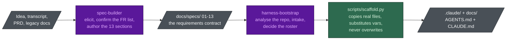

# claude-harness-bootstrap

Two Claude Code skills that stand up a complete, cost-aware, governed AI-agent harness in any repository.

[](https://github.com/nguyenhx2/claude-harness-bootstrap/actions/workflows/eval.yml)
[](LICENSE)
[](#what-the-two-skills-do)
[](harness-bootstrap/assets/claude/agents/)
[](eval/guardrail_eval.py)
[](https://claude.com/claude-code)
[](https://github.com/nguyenhx2/claude-harness-bootstrap/releases)

## The thesis

Models are commoditising: the frontier tier is a fast-moving, substitutable input, and the gap between
tiers is narrowing faster than the price gap is. What does not commoditise is the **harness** — the
agents, the rules, the hooks, the task board — plus the enterprise context it carries and the
**governance** wrapped around it. This repo is an attempt to build that harness, and to make the claim
falsifiable: [`eval/guardrail_eval.py`](eval/guardrail_eval.py) tests whether the safety floor survives
a model downgrade, and [`benchmark/`](benchmark/) tests whether the harness is actually cheap to install.

## The numbers

Baseline is `project-bootstrap`, the predecessor skill, at the commit it was replaced. Reproduce with
`python benchmark/benchmark.py`.

| | Before | After | Δ | Source |
|---|---:|---:|---:|---|
| Read path — bytes pulled into context per bootstrap | 234,196 | 83,339 | **−64%** | exact (bytes on disk) |
| Read path — tokens | ~65,000 | ~23,150 | −64% | **estimated** at 3.6 chars/token |
| Write path — bytes the model must author as output | 95,064 | 14,595 | **−85%** | exact |
| Write path — tokens | ~26,400 | ~4,100 | −85% | **estimated** at 3.6 chars/token |
| Session tax — rule content kept *out* of the default session | — | 49,394 of 74,697 B | **66%** | exact |
| Scaffold — the deterministic path that replaces model generation | — | ~0.2 s, 73 paths, exit 0 | — | wall clock; varies 0.15–0.30 s |
| Guardrail eval — safety properties that survive a model downgrade | — | **15/15** | — | `python eval/guardrail_eval.py` |

**Byte figures are exact. Token figures are estimated**, because the recorded run had no API key; the
script emits *measured* counts from the `count_tokens` endpoint when `ANTHROPIC_API_KEY` is set, and
labels the source either way. The write-path baseline is a proxy, and it is conservative. Read the
caveats before quoting any of this: [`benchmark/RESULTS.md`](benchmark/RESULTS.md).

The scaffold row is not a fifth of a second versus some other number of seconds — it is a fifth of a second of deterministic file
copying versus a model generating ~26,000 output tokens, which is minutes of wall clock, real money, and
a chance of hallucinating a hook that never runs.

## Install

```bash
git clone https://github.com/nguyenhx2/claude-harness-bootstrap.git
cp -r claude-harness-bootstrap/harness-bootstrap ~/.claude/skills/
cp -r claude-harness-bootstrap/spec-builder     ~/.claude/skills/
```

Then, in any repo, ask Claude Code to "set up the base" / "chuẩn hoá .claude" / "khởi tạo workspace cho
AI agents", or invoke `/harness-bootstrap` directly. Requires **Python 3** for the scaffolder.

## What the two skills do

| Skill | What it does |
|---|---|
| [`harness-bootstrap`](harness-bootstrap/) | Generates `.claude/` (agents with explicit model/effort/tool budgets, path-scoped rules, commands, hooks, `settings.json`), the `docs/` tree, and `AGENTS.md` + `CLAUDE.md`, so the repo runs under orchestrator-driven task control. Also has a read-only **audit mode** that builds an audit control plane beside untouched source. |
| [`spec-builder`](spec-builder/) | Generates the 13-section BA specification set under `docs/specs/` from any input — an idea, a transcript, meeting notes, an existing PRD, or legacy docs. Its governing rule: **never invent a requirement.** |

They compose: `spec-builder` writes the contract, `harness-bootstrap` builds the machine that implements it.



Green is deterministic and free; purple is a model and is billed; grey is a file on disk. The skill is
an attempt to move work from purple to green. Full diagram set — scaffolder internals, one feature end
to end, context loading — in [`docs/FLOWS.md`](docs/FLOWS.md).

## Why it is cheap

Four levers, ranked by how much they actually move the bill
([`reference/cost-model.md`](harness-bootstrap/reference/cost-model.md)):

| Lever | One line |
|---|---|
| **`effort:`** | Controls thinking depth, output length and turn count — and most rosters never set it, so every agent silently inherits the human's session level. |
| **Context hygiene** | Path-scoped rules, narrow `tools:` grants (every tool ships its schema on every request), `maxTurns` as a circuit breaker. |
| **Model tier** | A genuine 3–5x saving at the *Haiku* end. Test for "mechanical" first — that is where tier selection still pays. |
| **Prompt-cache stability** | Cache reads cost ~0.1x input. No timestamps, no run IDs, no generation dates in any asset — a single volatile byte in a system prompt cold-misses the cache on every future run. |

| Model | Alias | Input $/1M | Output $/1M |
|---|---|---:|---:|
| Claude Fable 5 | `fable` | $10.00 | $50.00 |
| Claude Opus 4.8 | `opus` | $5.00 | $25.00 |
| Claude Sonnet 5 | `sonnet` | $3.00 | $15.00 |
| Claude Haiku 4.5 | `haiku` | $1.00 | $5.00 |

**Opus is 1.67x Sonnet, not 5x.** Much published multi-agent advice predates these prices. Downgrading
a reviewer from Opus to Sonnet now saves ~40% on that agent's tokens, not ~80%, and buys it by weakening
the one seat whose entire job is to catch what a generation pass got wrong. So "put the cheap model
everywhere" is **not** the advice here: make the Opus-vs-Sonnet call on quality grounds, and take the
savings from `effort:`, from context hygiene, and from the bottom of the roster.

## Model sovereignty

The harness runs on any tier — the guardrails are shell scripts and glob matching, not model judgment.
Cost of **one feature** through the generated harness, by roster profile (`python benchmark/model_cost.py`):

| Roster profile | USD / feature | vs default |
|---|---:|---:|
| all-frontier (`fable`, xhigh) | 7.228 | 2.96x |
| all-opus (xhigh, no effort tuning) | 3.614 | 1.48x |
| **DEFAULT roster (this skill)** | **2.442** | **1.00x** |
| sonnet-only (high) | 1.974 | 0.81x |
| haiku-only (medium) | 0.630 | 0.26x |

Two things this table is honest about:

1. **The default roster is not the cheapest.** `sonnet-only` is ~19% cheaper. The default deliberately
   spends the difference on the review gates — `code-reviewer` and `security-reviewer` run on Opus
   because they exist to catch what the generation pass got wrong.
2. **This table is MODELLED, not measured.** It is arithmetic on published prices, over stated
   assumptions (turns per seat, bytes read and written, an effort multiplier) that live at the top of
   [`benchmark/model_cost.py`](benchmark/model_cost.py). Only the system-prompt sizes are grounded in
   the repo. Whether a cheaper roster produces *acceptable output* is a quality question this repo does
   **not** answer. [`eval/`](eval/guardrail_eval.py) tests the safety floor, not the quality ceiling.

What the eval does establish: a cheap model in this harness cannot read `.env`, cannot commit straight
to `main`, cannot edit an Accepted ADR, and cannot ship an AI-attribution trailer — not because it knows
better, but because a hook exits 2 and the tool call never happens. 15/15, byte-identical on any model.

## Governance

Three rules ship in every generated `.claude/rules/`. `model-policy` and `ai-governance` load
unconditionally — they decide what may be sent where *before* any file is touched, so no glob can scope
them. `ip-compliance` is path-scoped to the source and the dependency manifests.

| Rule | The decision it forces |
|---|---|
| [`model-policy.md`](harness-bootstrap/assets/claude/rules/model-policy.md) | **Data classification decides which model may process what.** Public / Internal / Confidential / Restricted, classified *before* dispatch. Unclassified means Confidential until someone says otherwise. |
| [`ip-compliance.md`](harness-bootstrap/assets/claude/rules/ip-compliance.md) | **A dependency licence is a decision, not a default.** The agent proposes; a human accepts. Missing or unclear licence means stop and ask. |
| [`ai-governance.md`](harness-bootstrap/assets/claude/rules/ai-governance.md) | **Gated actions need a human** who saw the specific action — not a config flag. Model output is a proposal: schema-validate it before use, never execute raw model text. |

## Layout

```
harness-bootstrap/
  SKILL.md                  navigation only - the decisions, not the content
  reference/                read at the step that needs it
    cost-model.md             model + effort + context budget doctrine
    roster.md                 which agents to field, and their exact config
    intake.md                 the questionnaire
    codebase-analysis.md      brownfield discovery -> Inventory Report
    task-control.md           the orchestration loop, crash recovery, merge discipline
    audit-mode.md             read-only multi-repo audit control plane
  assets/                   real files, copied verbatim with {{VAR}} substitution
    claude/{agents,rules,commands,hooks}/ + settings.json, docs/, root/, env/, audit/, manifest.json
  scripts/scaffold.py       deterministic, stdlib-only, never overwrites

spec-builder/
  SKILL.md
  reference/{ba-standards,elicitation,writing-rules}.md
  assets/specs/             13 section templates
  scripts/scaffold.py

benchmark/{benchmark.py,model_cost.py,RESULTS.md}   eval/guardrail_eval.py   docs/FLOWS.md
```

## Contributing and licence

Issues and PRs welcome. Two house rules, both taken from the repo's own doctrine: **no invented
numbers** — a script in `benchmark/` or `eval/` must print any figure you cite, and "estimated" is
said out loud; and **assets stay byte-stable** — no timestamps, generation dates or run IDs under
`assets/`, because they land in a system prompt and cold-miss the prompt cache forever.

MIT — see [LICENSE](LICENSE).
