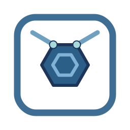
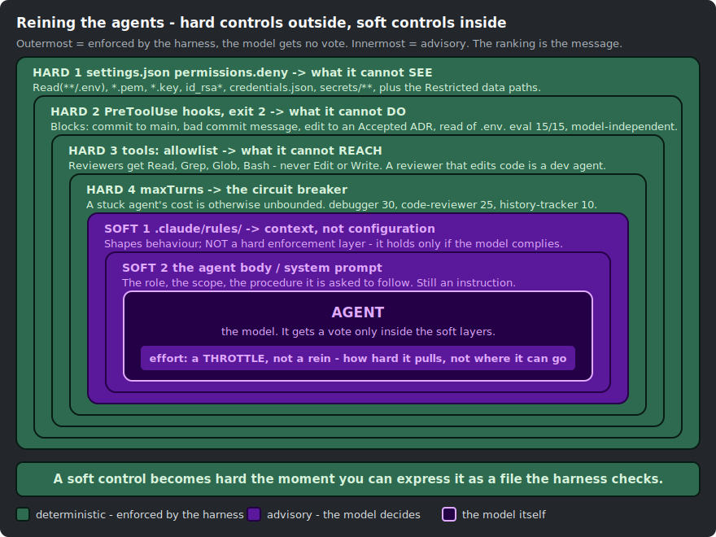
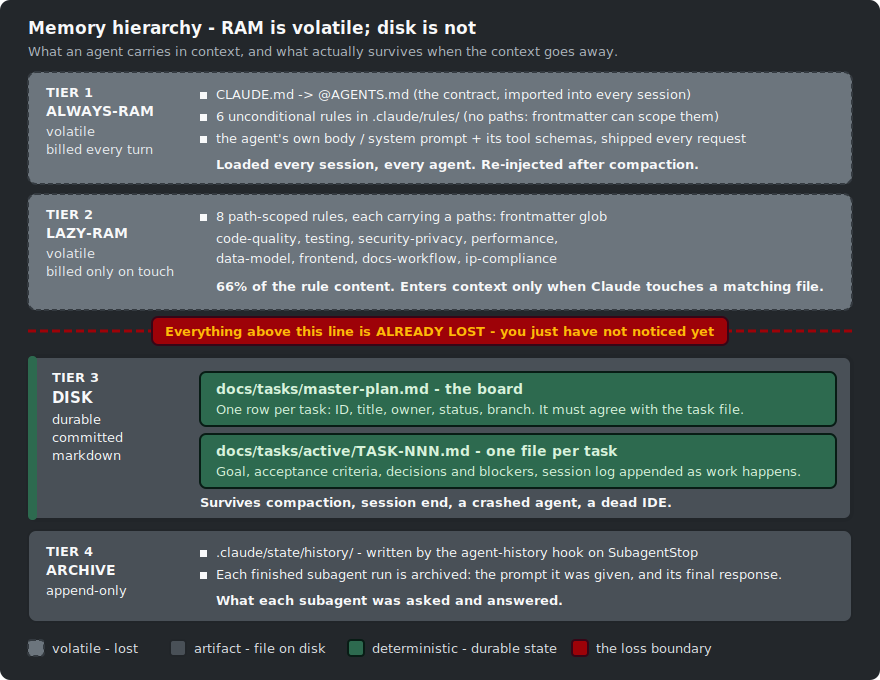
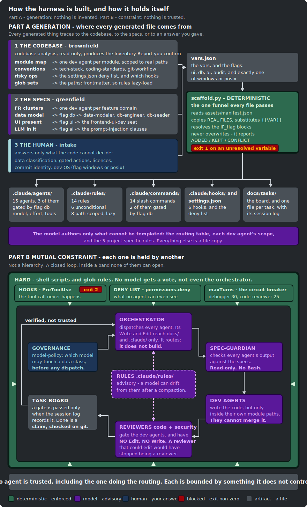
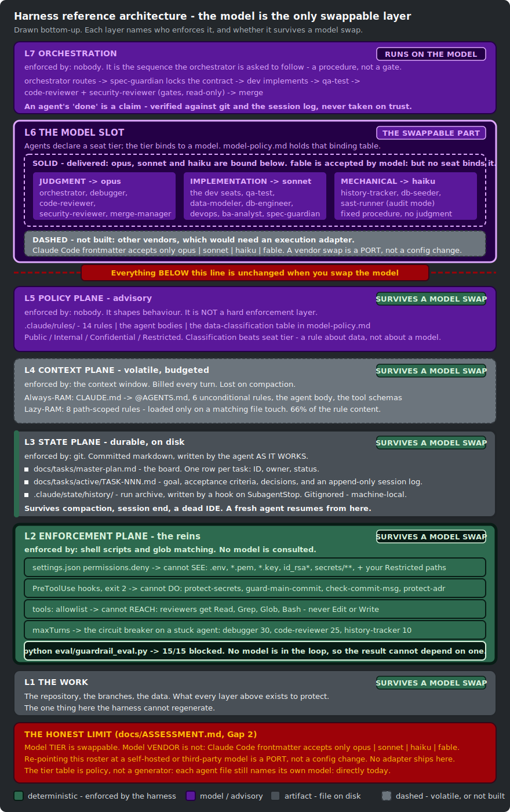

<p align="center">
  
</p>

<h1 align="center">Agent Harness Bootstrap</h1>

<p align="center"><b>Give an AI agent a repo it can actually understand, and a harness it cannot escape.</b></p>

<p align="center"><b>English</b> · <a href="README.ja.md">日本語</a></p>

[](https://github.com/nguyenhx2/agent-harness-bootstrap/actions/workflows/eval.yml)
[](LICENSE)
[](harness-bootstrap/assets/claude/agents/)
[](eval/guardrail_eval.py)
[](https://claude.com/claude-code)
[](https://github.com/nguyenhx2/agent-harness-bootstrap/releases/latest)

Two skills for **Claude Code**. `spec-builder` writes the spec an AI can build from. `harness-bootstrap`
builds the `.claude/` harness it runs inside - agents, rules, guardrails and a task board, fitted to
*your* repo. The result also ports to Cursor and Codex, guardrails included.

**Start here:**

```bash
curl -fsSL https://github.com/nguyenhx2/agent-harness-bootstrap/releases/latest/download/agent-harness-bootstrap.zip -o skills.zip \
  && unzip -o skills.zip -d ~/.claude/skills/ \
  && rm skills.zip
```

```text
/spec-builder           # write the contract first
/harness-bootstrap      # build or update the .claude harness for this repo
```

Requires Python 3. Full [install](#install) (including Cursor and Codex) and [usage](#use-it) below.

## Watch it in 60 seconds

<p align="center">
  <a href="https://nguyenhx2.github.io/agent-harness-bootstrap/video/">
    
  </a>
</p>

<p align="center"><i>The whole product in one clip.</i> <b><a href="https://nguyenhx2.github.io/agent-harness-bootstrap/video/">Watch the full set with sound-free captions in the gallery</a></b> - six clips, no download.</p>

## The problem, and what this does about it

Dropping an AI agent into a real repository raises the same hard questions every team hits:

| The problem | What this does about it |
|---|---|
| **You do not know what a good agent setup even looks like.** There is no standard for how agents, rules, guardrails and tasks fit together. | Generates one, shaped to your repo, instead of a blank `.claude/` you fill in by hand. |
| **You cannot get agents to run as a system.** One-off prompts do not compose. | An orchestrator dispatches scoped specialists against a task board, so multi-step work actually finishes. |
| **The agent invents what it was never told.** It hallucinates requirements, APIs, whole files, and they look plausible enough to merge. | `spec-builder` writes the contract first, with acceptance criteria it can be checked against, and refuses to fill a gap with a guess. |
| **Context fills, compacts, and the work vanishes.** The window closes and the progress existed nowhere else. | State lives in committed markdown the agent writes *as it works*, so a fresh agent resumes exactly where the last one stopped. |
| **One bad turn does real damage.** It can read `.env`, commit to `main`, edit an accepted decision. Telling it not to is advice it forgets after a compaction. | Hooks and a deny list block those actions without asking the model, so control does not depend on which model you run. |
| **Cost runs away quietly.** An agent with no model set bills mechanical work at the top tier. | Every agent carries an explicit model, effort and tool budget. |
| **Every tool reinvents the setup.** | The same harness ports to Cursor and Codex, guardrails included, from one source of truth. |

## Two skills

| | What it makes | You need it when |
|---|---|---|
| [**`spec-builder`**](spec-builder/) | **The input an AI can understand.** A 13-section spec set under `docs/specs/`: requirements with stable IDs, acceptance criteria, a data model, mandatory security NFRs. Built from an idea, a transcript, meeting notes, or a pile of legacy docs. It **never invents a requirement** - anything unstated becomes a flagged open issue. | The AI is guessing what to build, because nobody wrote it down. |
| [**`harness-bootstrap`**](harness-bootstrap/) | **The harness an AI runs inside.** `.claude/` with 15 agents, 14 rules, 6 blocking hooks and a deny list, plus `docs/tasks/`, a board that survives a crash. Fitted to *your* repo: it reads your code first, then builds the harness around what is actually there. | The AI can build, but nothing stops it doing damage and nothing survives when it forgets. |

They cover the two ends of the same gap: **the AI does not know what you want, and nothing constrains
what it does.**

<p align="center">
  
</p>

Green is deterministic and free. Purple costs tokens. The loop on the right runs the same on any model
tier, because the gates around it are shell scripts rather than judgment.

### The rest of the clips

Every clip plays in your browser - **[watch the gallery](https://nguyenhx2.github.io/agent-harness-bootstrap/video/)**,
no download. Sources in [`video/`](video/).

| Clip | Play in browser |
|---|---|
| **The complete solution** - the pain, both skills, the loop, the payoff | [MP4](https://nguyenhx2.github.io/agent-harness-bootstrap/video/mp4/04-solution.mp4) · [HTML](https://nguyenhx2.github.io/agent-harness-bootstrap/video/html/04-solution.html) |
| **What it is and why** - the problem, the two skills, the payoff | [MP4](https://nguyenhx2.github.io/agent-harness-bootstrap/video/mp4/01-overview.mp4) · [HTML](https://nguyenhx2.github.io/agent-harness-bootstrap/video/html/01-overview.html) |
| **The operating flow** - contract, scaffold, then the task loop | [MP4](https://nguyenhx2.github.io/agent-harness-bootstrap/video/mp4/02-flow.mp4) · [HTML](https://nguyenhx2.github.io/agent-harness-bootstrap/video/html/02-flow.html) |
| **The control layers** - deny list, hooks, rules, review gates | [MP4](https://nguyenhx2.github.io/agent-harness-bootstrap/video/mp4/03-layers.mp4) · [HTML](https://nguyenhx2.github.io/agent-harness-bootstrap/video/html/03-layers.html) |
| **`spec-builder` in depth** - elicit, confirm the FR list, then fill | [MP4](https://nguyenhx2.github.io/agent-harness-bootstrap/video/mp4/05-spec-builder.mp4) · [HTML](https://nguyenhx2.github.io/agent-harness-bootstrap/video/html/05-spec-builder.html) |
| **`harness-bootstrap` in depth** - analyse, scaffold, wire | [MP4](https://nguyenhx2.github.io/agent-harness-bootstrap/video/mp4/06-harness-bootstrap.mp4) · [HTML](https://nguyenhx2.github.io/agent-harness-bootstrap/video/html/06-harness-bootstrap.html) |

---

## Install

The two skills run inside **Claude Code** - that is where you invoke `/harness-bootstrap` and
`/spec-builder`. **Cursor** and **Codex** do not run the skills; they run the harness the skills
produce, so their setup is one command against an already-scaffolded repo.

### Claude Code

**[Download the latest release](https://github.com/nguyenhx2/agent-harness-bootstrap/releases/latest)**,
or install both skills in one line:

```bash
curl -fsSL https://github.com/nguyenhx2/agent-harness-bootstrap/releases/latest/download/agent-harness-bootstrap.zip -o skills.zip \
  && unzip -o skills.zip -d ~/.claude/skills/ \
  && rm skills.zip
```

Requires **Python 3**. Confirm what you installed:

```bash
cat ~/.claude/skills/harness-bootstrap/VERSION
```

### Cursor

Scaffold the harness once from Claude Code (or copy an existing `.claude/` in), then port it. From the
repo root:

```bash
python ~/.claude/skills/harness-bootstrap/scripts/port.py --target . --tool cursor
```

This writes `.cursor/rules/*.mdc` and `.cursor/hooks.json` plus its adapter. Cursor reads `AGENTS.md`
and the rules on its own; the hooks enforce through the adapter. No release to install - the porter
ships with the skill.

### Codex

Same starting point, one command:

```bash
python ~/.claude/skills/harness-bootstrap/scripts/port.py --target . --tool codex
```

Codex reads `AGENTS.md` natively and its hook payload matches Claude Code's, so this only writes
`.codex/hooks.json` pointing at the existing hooks. Use `--tool all` to set up Cursor and Codex at
once.

<details>
<summary><b>One skill at a time, a pinned version, checksums, or from source</b></summary>

<br>

```bash
# one skill at a time (stable URLs, always the newest release)
curl -fsSL https://github.com/nguyenhx2/agent-harness-bootstrap/releases/latest/download/harness-bootstrap.zip -o hb.zip
unzip -o hb.zip -d ~/.claude/skills/ && rm hb.zip

curl -fsSL https://github.com/nguyenhx2/agent-harness-bootstrap/releases/latest/download/spec-builder.zip -o sb.zip
unzip -o sb.zip -d ~/.claude/skills/ && rm sb.zip
```

```bash
# a pinned version
V=1.3.0
curl -fsSL "https://github.com/nguyenhx2/agent-harness-bootstrap/releases/download/v${V}/harness-bootstrap-v${V}.zip" -o hb.zip
unzip -o hb.zip -d ~/.claude/skills/ && rm hb.zip
```

```bash
# verify the download
curl -fsSLO https://github.com/nguyenhx2/agent-harness-bootstrap/releases/latest/download/SHA256SUMS
sha256sum -c SHA256SUMS --ignore-missing
```

```bash
# from source
git clone https://github.com/nguyenhx2/agent-harness-bootstrap.git
cp -r agent-harness-bootstrap/harness-bootstrap ~/.claude/skills/
cp -r agent-harness-bootstrap/spec-builder      ~/.claude/skills/
```

</details>

---

## Use it

Invoke each skill by its exact name, with a leading slash. The names are unambiguous, so they never
collide with a natural-language phrase that could match some other skill you have installed:

```text
/harness-bootstrap      # build or update the .claude harness for this repo
/spec-builder           # write the specs first
```

**If the repo already has code**, run `/harness-bootstrap` on its own. It reads the code before
writing anything - stack, modules, conventions, risky operations - and shows you that inventory first.
Most of the intake is pre-filled from what it found, so you are only asked what the code cannot tell
it. Existing files are **reconciled, not overwritten**: anything you wrote, or another tool created, is
reported as a `CONFLICT` and left in place for you to merge - never replaced.

**If you are starting from an idea and an empty repo**, run `/spec-builder` first, then
`/harness-bootstrap`. The specs come first because the agent roster comes out of them: cluster the
requirements into domains, one dev agent per domain, each scoped to the module path it will own.

Either way you see the plan - what will be created, kept and modified, plus every agent's model and
effort budget - and nothing is written until you approve it. The scaffold itself takes about a fifth
of a second.

Nothing here becomes global state. Both skills write only into the target repository, under `.claude/`
and `docs/`; they never touch your `~/.claude/skills/` directory, and the whole harness is a set of
files you can delete. Remove `.claude/` and the repo is exactly as it was.

### What lands in your repo

```text
.claude/
  agents/           15 agents, each with an explicit model, effort, tool grant and turn limit
  rules/            14 rules - 6 always loaded, 8 that load only when you touch a matching file
  commands/         /new-task /task-resume /implement-fr /review-changes /secret-scan /deploy ...
  hooks/            6 hooks that block bad actions before they happen
  settings.json     permission allow/deny + hook registration
docs/
  tasks/
    master-plan.md      the board: one row per task
    active/TASK-NNN.md  goal, acceptance criteria, and a session log the agent writes AS IT WORKS
  specs/ requirements/ architecture/ context/ templates/
AGENTS.md + CLAUDE.md
```

---

## What the harness guarantees

### It cannot do the dangerous thing

Not "is told not to". **Cannot.** The guardrails are shell scripts and glob rules:

| An agent tries to | Result |
|---|---|
| Read `.env`, a private key, `~/.ssh/`, `.npmrc` | Blocked |
| Read a path you classified as Restricted | Blocked. It never sees the data, so it cannot send it to any model |
| Commit straight to `main` | Blocked |
| Edit an Accepted ADR | Blocked |
| Ship a commit with an AI-attribution trailer | Blocked |

```bash
python eval/guardrail_eval.py   # 15 known-bad payloads at a real generated harness -> 15/15
```

Swap every agent from Opus to Haiku and re-run. Identical result: no model is in the loop.

<p align="center">
  
</p>

Rules in `.claude/rules/` are **advice**, and a model can drift from them after a compaction. Hooks,
`permissions.deny`, `tools:` and `maxTurns` are **enforcement**. A control moves from soft to hard the
moment it can be written as a file check.

### The IDE can die and you lose nothing

<p align="center">
  
</p>

State lives in committed markdown, written as the agent works, not in a context window that compaction
will summarise away. After a crash, an agent with an empty context scans `docs/tasks/active/`, reads
the session log, reconciles branches against the board, verifies against `git` rather than memory, and
continues from the last recorded row. `/task-resume` does it for you.

The rule that makes it work: **a gate counts as passed only when the session log records it.** An
agent's "done" is a claim you verify, never a fact.

Details: [`docs/CONTEXT-MANAGEMENT.md`](docs/CONTEXT-MANAGEMENT.md).

### You stop paying for tokens you did not choose to spend

| Default | Here |
|---|---|
| An agent with no `model:` inherits the caller's tier, so a log-summarising agent bills at Opus rates | Every agent has an explicit `model:` and `effort:` |
| A rule with no `paths:` loads into every session of every agent, forever | 8 of 14 rules are path-scoped. **66% of rule content never enters a default session** |
| An agent that loops burns full context every turn, unbounded | `maxTurns` on every seat where a loop means something already went wrong |
| Omitting `tools:` inherits every tool on the machine, schema included | Narrow grants. Reviewers get `Read, Grep, Glob, Bash` and nothing else |

| Roster | USD / feature |
|---|---:|
| all-opus, no effort tuning (what you get by not choosing) | 3.53 |
| **default roster** | **2.38** |
| sonnet-only | 1.92 |
| haiku-only | 0.61 |

Opus is **1.67x** Sonnet, not 5x, so tier is a smaller dial than most advice assumes and `effort:` is a
bigger one. The default roster is deliberately not the cheapest: it spends the difference on Opus review
gates. Take the other side of that bet by editing one table in
[`roster.md`](harness-bootstrap/reference/roster.md). These figures are modelled from published prices,
not measured - run `python benchmark/model_cost.py`.

---

## How the harness is built, and how it holds itself

<p align="center">
  
</p>

Nothing in your `.claude/` folder is invented. Each agent, rule, hook and deny entry traces back to
something real: your code, your specs, or an answer you gave at intake, and `scaffold.py` copies the
rest from files on disk. Once it runs, the pieces hold each other: the orchestrator dispatches every
agent but cannot write product code, the reviewers gate the dev agents but cannot edit anything, the
board records what actually happened, and the hooks stop all of them without asking.

### The whole thing, in one picture

<p align="center">
  
</p>

The model sits in a slot near the top. Every layer beneath it - the deny list, the hooks, the tool
grants, the board - is deterministic and unchanged when the model changes.

Model **tier** is swappable today: `opus`, `sonnet`, `haiku`, `fable`. Model **vendor** is not.
Re-pointing the roster at a self-hosted or third-party model is a port rather than a config change, and
no adapter ships here. See [`docs/ASSESSMENT.md`](docs/ASSESSMENT.md), Gap 2.

---

## Also runs in Cursor and Codex

Cursor and Codex both have hook systems close enough to Claude Code's that the guardrails port, not
just the rules. The one-command setup for each is in [Install](#install) above; here is what actually
crosses over and where it stops:

| | Claude Code | Cursor | Codex |
|---|---|---|---|
| Rules | `.claude/rules/*.md` | `.cursor/rules/*.mdc` (`paths:` becomes `globs:`) + `AGENTS.md` | `AGENTS.md` (read natively) |
| Enforcement | `settings.json` hooks | `.cursor/hooks.json` + a generated adapter | `.codex/hooks.json` (hooks register directly) |
| Blocks a secret read, a commit to `main` | yes | yes | yes |

**Codex** reads `AGENTS.md` at the repo root with no setup, and its hook payload is identical to
Claude Code's, so the porter registers the existing hooks directly in `.codex/hooks.json`.

**Cursor** reads `AGENTS.md` and `.cursor/rules/*.mdc`. Its hook events and output differ, so the
porter writes a small adapter that translates Cursor's payload to the harness hooks and back. The
adapter is unit-tested in CI: it correctly denies a `.env` read and a commit to `main`, and allows
`npm test`.

Two honest limits, both printed by the porter and enforced nowhere else:

- **Codex** routes file edits through `apply_patch` with the path inside the command, so `protect-adr`
  (which reads a file path) is best-effort there. The Bash guards are exact.
- **Cursor**'s `afterFileEdit` is observational, so an edit to an Accepted ADR is flagged after the
  fact rather than blocked before. Everything reachable through a shell command or a file read blocks
  the same as in Claude Code.

The three tools share one source of truth. `AGENTS.md` is the contract; `.claude/`, `.cursor/`, and
`.codex/` are three renderings of it, generated from the same assets. Each tool has a page with the
exact files, the enforce-vs-advice table, and how to verify it:

- [**Claude Code**](docs/tools/claude-code.md) - the reference: how the harness is generated and enforced.
- [**Cursor**](docs/tools/cursor.md) - the `.mdc` rules and the hook adapter.
- [**Codex**](docs/tools/codex.md) - native `AGENTS.md` and the directly registered hooks.

---

## Governance

Three rules ship into every repo you bootstrap. You supply the answers at intake; the skill never
invents a policy for your company.

- [**`model-policy.md`**](harness-bootstrap/assets/claude/rules/model-policy.md) - classify your data
  (Public / Internal / Confidential / Restricted) and say which models may process each class.
  Restricted paths are denied at the read boundary, so an agent cannot leak what it cannot open.
- [**`ip-compliance.md`**](harness-bootstrap/assets/claude/rules/ip-compliance.md) - dependency licence
  allow/deny, the AGPL-on-SaaS trigger, and a diff check the reviewers can run.
- [**`ai-governance.md`**](harness-bootstrap/assets/claude/rules/ai-governance.md) - which actions need
  a human who saw the specific action, not a config flag.

---

## Reference

| | |
|---|---|
| [`FLOWS.md`](docs/FLOWS.md) | Seven diagrams: the scaffolder, one feature end to end, context loading |
| [`CONTEXT-MANAGEMENT.md`](docs/CONTEXT-MANAGEMENT.md) | RAM vs disk, the resume protocol, hard vs soft controls |
| [`ASSESSMENT.md`](docs/ASSESSMENT.md) | Scorecard, including what this does not do |
| [`cost-model.md`](harness-bootstrap/reference/cost-model.md) | How model, effort, tools and cache stability affect the bill |
| [`roster.md`](harness-bootstrap/reference/roster.md) | Every agent's model, effort, tools, turn limit, and why |
| [`task-control.md`](harness-bootstrap/reference/task-control.md) | The orchestration loop, crash recovery, merge discipline |
| [`audit-mode.md`](harness-bootstrap/reference/audit-mode.md) | Read-only audit control plane, for source agents must never modify |
| [`ba-standards.md`](spec-builder/reference/ba-standards.md) | Which standards the 13 spec sections draw on |
| [`RESULTS.md`](benchmark/RESULTS.md) | Benchmark numbers and their caveats |
| [`RELEASING.md`](docs/RELEASING.md) | Semver, artifacts, note format |
| [`video/README.md`](video/README.md) | The clip set, the palette, and how to regenerate it |

### Numbers

Measured against the predecessor skill this replaces. Reproduce with `python benchmark/benchmark.py`.

| | Before | After | Δ |
|---|---:|---:|---:|
| Bytes the model must read to bootstrap a repo | 234,196 | 85,641 | **-63%** |
| Bytes the model must write as output | 95,064 | 14,595 | **-85%** |
| Rule content kept out of the default session | - | 49,394 of 74,697 B | **66%** |
| Scaffold time | - | ~0.2 s, 73 files | - |
| Guardrail eval | - | **15/15** | - |

Byte figures are exact. Token figures are estimated unless `ANTHROPIC_API_KEY` is set, in which case
the script counts them against the real endpoint.

---

## Contributing

- **No invented numbers.** A script in `benchmark/` or `eval/` must print any figure you cite.
- **Assets stay byte-stable.** No timestamps or run IDs under `assets/` - they land in a system prompt
  and cold-miss the prompt cache forever.
- **No em-dashes.** Plain hyphens.

Releases follow [`docs/RELEASING.md`](docs/RELEASING.md).

MIT - see [LICENSE](LICENSE).
