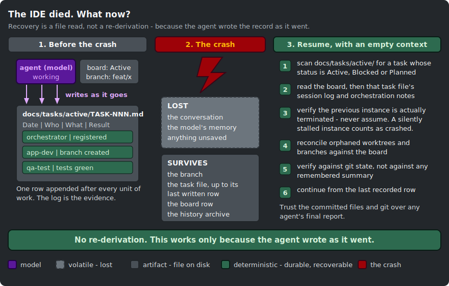

# Context management: state on disk, not in the model

The mechanism this repository is actually built on, and the one it explains least: **agent state is
anchored to physical files, not to the model's context window.** Every durable fact about a mission -
what the task is, what has been decided, what has run, what passed, what is blocked, who owns it -
exists as committed markdown before it exists as a claim in a conversation. That is why a compaction,
a session end, a killed process, or a dead IDE costs this harness a conversation and not a mission.

This document explains the design, names the files that implement it, and is honest about the places
where the guarantee stops.

## The framing this builds on

Alberto Arena, in [CLAUDE.md is RAM, not disk](https://albertoarena.it/posts/claude-md-is-ram-not-disk/),
gives the clearest available metaphor for context budgeting. His argument, fairly stated:

- `CLAUDE.md` is **always-loaded working memory**. It is consumed on every turn, in every session. It
  is RAM.
- `docs/` is **on-demand long-term memory**. It is read when it is needed and not before. It is disk.
- The test he proposes is a single question: *"Does Claude need this every time, or only sometimes?
  Every time goes in CLAUDE.md. Sometimes goes in docs/"*.
- A bloated `CLAUDE.md` makes Claude **worse**, not better. It crowds the window with detail that is
  irrelevant to the task in hand, and it charges you tokens for that irrelevance on every single turn.
  He puts the onset of degradation "somewhere around line two hundred".
- Nested `CLAUDE.md` files scope rules to a folder, so folder-specific detail does not tax the root.

That is correct and this repo follows it. `harness-bootstrap/assets/root/CLAUDE.md` is a nine-line
Claude-specific surface on top of a single `@AGENTS.md` import, and `AGENTS.md` carries an explicit
budget comment:

> `Keep AGENTS.md and CLAUDE.md under about 200 lines combined: instruction adherence drops on longer
> files. Detail belongs in .claude/rules/, which is read on demand, not here.`

Same number, same reason.

## Where this repo goes further

Arena's metaphor is about **size**: what is worth loading every turn. This repo pushes it to
**durability**: what survives when the window does not.

The sharper claim, and the one this document defends:

> **RAM is not just expensive. RAM is volatile. Anything that exists only in the model's context is
> already lost - you just have not noticed yet.**

Compaction will summarise it and drop the specifics. A session end discards it. A crashed agent takes
its working memory with it. An IDE that dies takes the whole window at once. None of these are exotic.
`.claude/rules/task-tracking.md` treats them as routine and says so:

> `Context loss is routine; treat recovery as routine too.`

So the design question is not only *what do we load every turn*. It is:

> **What is written down such that a fresh agent, with an empty context, can pick the work up exactly
> where it stopped?**

Everything below is the answer to that question.

## 1. The memory hierarchy, as this repo implements it

Four tiers, not two. The two tiers Arena names are both RAM; the interesting half of this harness is
the two below them.


| Tier | What lives there | When it loads | What it costs | What compaction does to it |
|---|---|---|---|---|
| **Always-RAM** | `CLAUDE.md` (which is just `@AGENTS.md` plus the Claude-specific surface), the 6 unconditional files in `.claude/rules/`, the agent's own body, its tool schemas | Every session, every agent, before any file is touched | ~25,300 bytes of rules alone, re-sent every turn, forever | Survives. The project-root `CLAUDE.md` is re-injected after compaction. A **nested** `CLAUDE.md` is not: it re-enters context only when a file in that directory is read again |
| **Lazy-RAM** | The 8 path-scoped files in `.claude/rules/` (`paths:` frontmatter) | Only when Claude touches a file matching the glob | ~49,400 bytes that most sessions never pay for | Follows the same rule as the trigger: gone from the window, reloaded when a matching file is touched again |
| **Disk** (the state of the work) | `docs/tasks/master-plan.md` (the board) and `docs/tasks/active/TASK-NNN.md` (goal, scope, acceptance criteria, decisions and blockers, session log) | On demand, by an explicit `Read` | A few hundred bytes read once per session | **Nothing.** It is committed markdown in git. This is the tier that survives everything |
| **Archive** (append-only) | `.claude/state/history/` - one markdown file per finished subagent run, holding the prompt it was given and its final response | Never, unless read | Zero, until someone asks | Nothing. It is written by a hook after the fact, so no amount of context loss can erase it |

### Always-RAM: the six that earn it

`.claude/rules/00-overview.md` states the loading contract:

> `No paths: frontmatter means the file loads into EVERY session, at CLAUDE.md priority. Only the six
> files listed below earn that: they either bind the agent's behavior or decide what may be sent where,
> and both questions arise before any file is touched. Keep them short.`

The six are `00-overview.md`, `agent-guardrails.md`, `model-policy.md`, `ai-governance.md`,
`task-tracking.md`, and `conventional-commits.md`. Note what they have in common: none of them can be
path-scoped even in principle. `conventional-commits.md` governs commit *messages*, and a message is
not a file, so no glob can ever match it - which is exactly why that file is deliberately kept under
25 lines. `model-policy.md` and `ai-governance.md` decide what may be sent to which model *before* any
file is opened, so scoping them to a file that has not been read yet is incoherent.

`task-tracking.md` earns its slot for the reason stated in its own first line:

> `Loaded in every session, deliberately: an agent that forgets where state lives will invent it.`

That is the whole hierarchy in one sentence. The tier that tells the agent where disk *is* has to live
in RAM, or the agent hallucinates it.

### Lazy-RAM: the 66%

Everything else in `.claude/rules/` carries a `paths:` block:

```markdown
---
paths:
  - "{{UI_GLOBS}}"
---
# Frontend
```

`benchmark/RESULTS.md` measures the effect: 6 unconditional rules at 25,303 bytes against 8
path-scoped rules at 49,394 bytes. **66% of the rule content is kept out of the default session.** The
database agent no longer carries the frontend rules; the UI agent no longer carries the migration
rules. `reference/cost-model.md` calls this "the single largest recurring saving available and it costs
nothing but frontmatter", and it is Arena's test applied mechanically: *every time* is unconditional,
*sometimes* gets a glob.

### Disk: where the mission actually lives

Two files, and they are the point of the whole design.

- **`docs/tasks/master-plan.md`** - the board. One row per task: ID, title, owner, deps, priority,
  phase, status. It is the only thing that allocates task IDs (`task-control.md`: *"the board allocates
  task IDs, never the brief"*).
- **`docs/tasks/active/TASK-NNN.md`** - one file per task, created from `docs/templates/TASK.md`. It
  carries the frontmatter `status:`, the goal, the inputs, the acceptance criteria, a decisions and
  blockers section, and the **session log**: an append-only table of `| Date | Who | What was done |
  Result |`.

Status is deliberately duplicated - once in the task file's frontmatter, once in the board row - and
`task-control.md` requires that both be written in the same step, and that the board row be read back
afterwards, because *"a write nobody confirmed is a wish"*.

The five states are defined exactly once, in the frontmatter comment of `docs/templates/TASK.md`:
`Planned | Active | Blocked | Pending | Done`. Every other file links to that definition instead of
restating it. The one counter-intuitive rule is worth repeating because it exists purely to serve
crash recovery: **a `Planned` task file lives in `active/`, not `pending/`.** From `task-control.md`:

> `The orchestrator's session-start scan reads docs/tasks/active/ - that directory means "on the work
> queue", not "being worked right now". Filing a newly-registered task under pending/ would hide it
> from the scan, and it would never be picked up.`

The directory layout is not filing. It is the index that the resume protocol scans.

These files are **committed**, and they ship in the same PR as the work they describe
(`task-control.md`, Phase 3, step 4). That is what makes them survive a machine, not just a session.

### Archive: the append-only record nobody had to remember to write

`.claude/hooks/agent-history.sh` (and its `.ps1` twin) is registered in `settings.json` on the
**`SubagentStop`** event with matcher `*`. Every time any subagent finishes, the hook reads that
subagent's own JSONL transcript, extracts the first user turn (the prompt it was given) and the last
assistant turn (its final response), and writes them to
`.claude/state/history/<timestamp>-<agent>-<slug>-<rand>.md`.

Two properties matter:

- It is **not something the agent chooses to do.** The harness does it. An agent that crashes without
  writing a session-log row still leaves an archive entry, because the hook fires on the stop event,
  not on the agent's cooperation.
- It **always exits 0**. The hook's own header states the contract: *"This hook must never block a run
  and never throw."* An audit trail that can break a build is an audit trail people turn off.

The `history-tracker` agent (`haiku`, `effort: low`, `maxTurns: 10`) exists solely to read this
archive, and its instructions are pointed: *"do not fill gaps with plausible reconstruction - if the
archive does not say, the answer is 'the archive does not say'."*

**The honest limit:** `.claude/state/` is **gitignored**. The archive survives compaction, session end,
and process death - it is on the disk of the machine that ran the agent. It does not survive a fresh
clone on a different machine. `model-policy.md` states this exactly: *"the run archive under
.claude/state/history/ is on disk and usually backed up even though it is gitignored"*. Committed task
files are the durable tier; the archive is the forensic one.

### A side effect worth naming: disk is what keeps RAM cacheable

`reference/cost-model.md` gives a rule that looks like a caching tip and is really a restatement of
this whole architecture:

> **Agent bodies, rule files, and CLAUDE.md must be byte-stable across runs.**
>
> `Put volatile state where it belongs - in the task file under docs/tasks/, which the agent reads as
> a message, not in the system prompt it is.`

Prompt caching is a prefix match over `tools` -> `system` -> `messages`. A single `Generated:
2026-07-14` line at the top of an agent file cold-misses that agent's cache on every future run. So
the discipline that makes state durable (write it to `docs/tasks/`) is the same discipline that makes
the RAM tier 10x cheaper (keep the system prompt byte-identical). They are not two rules. They are one
rule seen from two ends.

## 2. Why conversation memory is not a substitute

`.claude/rules/task-tracking.md` opens with the flat assertion:

> `The conversation is not the record. Context gets compacted, sessions end, agents are replaced
> mid-flight. What survives is what is written down.`

It is worth spelling out *why* that has to be a rule, because the failure it prevents is not "the agent
forgets". The failure is worse: **the agent remembers, and the memory is worthless as evidence.**

Consider an agent that ran the test suite, saw it green, and did not write that down. It now holds a
true belief about the world. But the belief lives in a context window that the orchestrator cannot
read, that compaction will summarise into "tests were run", and that a crash will delete. Nobody
downstream can verify it. So the harness rules that it did not happen:

> `A gate counts as passed only when the task file's session log records the run. A claim in a chat
> message, a PR description, or an agent's final report is a claim, not a fact. Verify against git
> state and the log.`
> - `.claude/rules/task-tracking.md`

The orchestrator carries the same rule from the other side (`orchestrator.md`, section 4):

> `Do not take "done" on faith. An agent's "done" / "passed" / "merged" is a CLAIM to verify against
> git and the task file, never a fact.`

And `task-control.md` names the observed failure that motivated it: *"Orchestrators have reported 'all
gates green' over a log holding no reviewer rows at all."*

This is invariant principle 5 in `AGENTS.md`, and note who it binds:

> `**Verify, do not trust.** An agent's "done", "passed", or "merged" is a claim, not a fact. Check it
> against git and the task file before acting on it. **This includes your own claims.**`

An agent's memory of its own work is not privileged. It is testimony, and testimony without an artifact
is nothing. Writing it down is not bookkeeping overhead bolted onto the real work - it *is* how the
work becomes real to anyone but the agent doing it.

## 3. The resume protocol

This is the part nobody designs until it bites, so it is designed here.



### Session start: scan before you accept

`orchestrator.md`, section 1, is unambiguous. **Before** accepting a new mission:

```
grep -l "status: Active" docs/tasks/active/*.md
grep -l "status: Blocked" docs/tasks/active/*.md
```

Then read `docs/tasks/master-plan.md`. And then:

> `Unfinished work takes priority: read the task file's session log and continue from the recorded
> state. **The task files, not conversation memory, are the source of truth** - this is what makes the
> base survive compaction.`

Unfinished work outranks a new mission. That ordering is the whole reason the scan comes first: an
orchestrator that accepts the new brief before scanning has already forked the board.

### Rebuild from the files, not from what you remember

`/task-resume TASK-NNN` (`.claude/commands/task-resume.md`) is the command that does this, and its
allowed-tools list is itself a control - `Bash(git status)`, `Bash(git diff:*)`, `Bash(git log:*)`,
`Read`, `Grep`, `Edit`. It cannot commit. It cannot push. It reads and reconciles.

Its five steps:

1. Read `docs/tasks/master-plan.md` for position, dependencies, priority.
2. Read the task file end to end: session log, decisions, blockers, acceptance criteria.
3. **Trust the files over conversation memory.** *"The conversation may have been compacted; the files
   were committed."*
4. Verify the working tree with `git status`, `git diff`, `git log`. *"The files record intent, the
   tree records reality. When they disagree, reconcile before continuing: inspect uncommitted work and
   drive it to completion or escalate it. Never stash, discard, or clobber it."*
5. Continue, appending a session-log row after every meaningful unit of work.

Run with no argument, it does not resume anything - it lists every unfinished task (`Planned`,
`Active`, `Blocked`) with its board row, priority, and blockers. That is the "where was I" command.

### Crash recovery: verify the corpse

`task-control.md` has a section on this and it is the most operationally hard-won part of the repo.

**Only one orchestrator may drive a project at a time.** A crashed instance can auto-resume later, so a
replacement must **verify the previous one is actually terminated - not presume it dead** - before it
dispatches anything. Two live orchestrators mean duplicate dispatches and conflicting merges.

**A silent stall counts as a crash.** From `orchestrator.md`: *"A silently stalled instance counts as
crashed."* And from `task-control.md`: *"Going silent is a failure mode equal to crashing. Supervisors
treat prolonged silence the same way: presume the instance crashed and resume it from file state -
which works, by design."* That last clause is the entire thesis in five words.

**Reconciliation, mandatory before the first dispatch after a crash:**

1. Compare git reality against the recorded plan: `git worktree list`, `git branch -a`, `git log`,
   cross-checked against the board and the task files.
2. Classify every in-flight branch or worktree: already merged (clean it up), complete but unmerged
   (re-run the gates, then merge), abandoned mid-work (inspect the diff, adopt it or redo the task).
3. Remove orphaned locked worktrees and stale branches left by the crashed instance.
4. Log the incident in the affected task files' session logs, *"so the audit trail stays honest"*.

**Trust ordering, stated as a rule:**

> `Committed files and git state OVER any agent's final report. A status report can reference branches
> or work that do not exist. Verify every claim against git facts.`

### The MISSION-COMPLETE marker: telling "done" from "dead" by a file check

Here is the problem the marker solves. An orchestrator that finished its mission and is sitting idle
produces exactly the same observable signal as an orchestrator that crashed: **silence**. A supervisor
looking at silence cannot tell which it is, and both wrong answers are expensive - re-dispatching a
finished mission duplicates work, and abandoning a crashed one loses it.

So close-out writes a durable, machine-checkable marker (`orchestrator.md`, section 6):

1. Set the mission's status in `docs/tasks/master-plan.md` to a terminal state, **and read the row back
   to confirm the write landed.**
2. Append a final row to the mission's log:
   `| <date> | orchestrator | MISSION COMPLETE - board audited | Done |`

Then deliver the summary and **terminate**. The rule against lingering is explicit: *"Never linger idle
after close-out: an idle instance is indistinguishable from a crashed one, and a lingering one invites
a duplicate orchestrator to be spawned against the same board."*

The disambiguation is then a `grep`, not a judgment (`task-control.md`):

- **No marker + silent = crashed mid-flight** -> resume from file state.
- **Marker present + silent = finished** -> do NOT resume, do NOT re-dispatch. *"Nothing is in flight,
  and stopping that instance is cleanup, not interruption: all state already lives in committed files."*

This is the pattern generalised: an ambiguity in the model's world is resolved by making the two cases
differ **on disk**.

### "The IDE died mid-task. What now?"

The concrete procedure, in order:

1. **Reopen. Do not re-brief.** Do not paste in what you think the agent was doing. That reintroduces
   a remembered state as if it were a recorded one, which is the exact failure the design exists to
   prevent.
2. **Confirm the old process is gone.** A killed IDE window does not always mean a killed agent
   process. Verify termination; never assume it.
3. **`/task-resume`** with no argument. It lists every unfinished task from `docs/tasks/active/`.
4. **`/task-resume TASK-NNN`** on the one that was in flight. Read the board row, then the task file
   end to end.
5. **Reconcile against git.** `git status`, `git diff`, `git log`, `git worktree list`, `git branch -a`.
   The task file says what was intended; the tree says what exists. Uncommitted work in the tree is
   inspected and driven to completion or escalated - **never stashed, discarded, or clobbered**.
6. **Log the incident** as a session-log row in the affected task file.
7. **Continue.** The last session-log row is the resume point.

If you want to know what the crashed agent was actually asked and what it last said, that is what
`.claude/state/history/` is for, and `history-tracker` is the agent that reads it.

## 4. Reining the agents: control surfaces ranked by hardness

The Vietnamese for this is *ghi cuong ngua* - reining a horse. You do not rein a horse by explaining
your preferences to it. The distinction that matters is **enforced** versus **advisory**, and this repo
is unusually blunt about which of its own controls are which.


### Hard: enforced by the harness, the model does not get a vote

| Control | Where | What it stops |
|---|---|---|
| `permissions.deny` in `settings.json` | `Read(**/.env)`, `Read(**/*.pem)`, `Read(**/secrets/**)`, `Bash(git push --force:*)`, `Bash(rm -rf:*)`, plus a `{{RESTRICTED_DENIES}}` slot at the head of the list | What the agent cannot even **see**. The action never reaches a tool call |
| **PreToolUse hooks**, exit code 2 | `protect-secrets`, `guard-main-commit`, `check-commit-msg`, `protect-adr` | What the agent cannot **do**: read a `.env`, commit to `main`, ship a non-conventional commit message, edit an ADR whose on-disk status is `Accepted` |
| `tools:` allowlist in agent frontmatter | e.g. `code-reviewer` and `security-reviewer` get `Read, Grep, Glob, Bash` | What the agent cannot **reach**. A reviewer with `Edit` has stopped being a reviewer, and the frontmatter is what makes that structural rather than aspirational |
| `maxTurns` | e.g. `history-tracker: maxTurns: 10` | The circuit breaker. `cost-model.md`: *"the cost of a stuck agent is unbounded"* |

These are not claims. `eval/guardrail_eval.py` scaffolds a harness and fires 15 known-bad payloads at
it: **15/15 blocked**. Every block is a shell script and an exit code, which is why the eval's header
can say what it says:

> `A cheap model cannot commit a secret. It cannot commit straight to main. It cannot edit an accepted
> ADR. It cannot ship an AI-attribution trailer. Not because it knows better, but because the hook
> exits 2 and the tool call never happens.`

Swap Opus for Haiku and the result is byte-identical. **The safety floor is model-independent.**

### Soft: advisory, and named as such

- **Rules in `.claude/rules/`.** These are context, not configuration. `docs/ASSESSMENT.md` quotes
  Claude Code's own documentation rather than hedging: rules *"shape Claude's behaviour but are not a
  hard enforcement layer"*. A rule is a very good way to make an agent do the right thing. It is not a
  way to make it impossible to do the wrong one.
- **The agent body / system prompt.** Same category. It is instruction, and instruction can be
  outweighed, forgotten after compaction, or simply not followed.
- **`effort:`** is not a control at all. It is a **throttle**. It sets how hard the model pulls, not
  where it is allowed to go. `cost-model.md`: *"Do not starve a judgment seat to save money."* Lowering
  `effort` on an agent you do not trust makes it a worse agent, not a safer one.

`agent-guardrails.md` builds this into a four-layer model and puts rules at layer 3 of 4, with the
concession stated outright: *"Rules are layer 3 - they are not the only layer, and they are not a
substitute for the other three."*

### The key move: a soft control becomes hard when you can express it as a file the harness checks

"Never commit to main" appears twice in this repo, deliberately. Once as prose in `AGENTS.md` (soft),
and once as `.claude/hooks/guard-main-commit.sh`, which parses the `Bash` tool call, resolves the
target directory from any `cd` or `git -C`, checks the effective branch, and **exits 2** (hard). The
rule and the hook say the same thing. Only one of them is enforced, and the other one exists so the
agent knows *why* before it hits the wall.

The migration path is always the same: **find the tool call the violation is shaped like, and intercept
it.** `docs/ASSESSMENT.md` walks exactly this move for data classification. The rule
(`model-policy.md`) says which model may process which data class. That was advisory. The fix was not
to write a better rule - it was to notice that Restricted data lives at *known paths*, and that
`permissions.deny` on `Read(<those paths>)` means **the agent never obtains the data at all**, and
therefore cannot leak it to any model on any provider, regardless of which model is driving or whether
it read the rule. Advisory became deterministic by changing what it was expressed as.

### And the ones that could not be made hard, named honestly

`docs/ASSESSMENT.md` refuses to overclaim, and this document will not either:

- **Model routing is still advisory.** Nothing prevents an agent from putting Confidential-but-readable
  text into a prompt to a model the policy table does not permit. The reason is precise and worth
  understanding, because it generalises: *"There is no tool call shaped like 'sent this text to that
  provider', so there is nothing for a hook to intercept."* A control surface needs a surface. Where
  there is no interceptable event, there is no hook, and claiming a deny rule enforces it would be
  theatre.
- **Data the org cannot locate.** If Restricted material has no nameable path, the deny list cannot
  cover it and the classification table is advice. The intake now forces that admission rather than
  letting it pass silently - *"but an admission is not a control."*

The honest summary, from `ASSESSMENT.md`: **this repo enforces model sovereignty at the data boundary,
and governs it by rule everywhere else.**

### The whole architecture, with the model drawn as what it is: a layer

The memory hierarchy of section 1 and the control ranking above are two views of the same stack. Put
them together and the design's central claim becomes a picture rather than an argument.


Read it bottom-up. The work is at the bottom, and everything above it exists to protect it. The
enforcement plane is the thickest band because it is the only one that does not negotiate: shell
scripts and glob matching, no model consulted, `15/15`. Above that, the state plane is markdown in
git; the context plane is the volatile window this whole document is about; the policy plane is
advice. Only then does the **model** appear - in a slot, near the top, with the seat-tier bindings
(`judgment -> opus`, `implementation -> sonnet`, `mechanical -> haiku`) drawn as replaceable contents
rather than as structure.

That is the point of drawing it this way. **Every layer beneath the slot is model-agnostic.** Swap the
tier bindings and the deny list, the hooks, the tool grants, the `maxTurns`, the board, the task files
and the run archive are all byte-for-byte what they were. The safety floor and the durable state do not
sit *on top of* a model choice; they sit *underneath* it.

And the diagram carries the caveat with it, because an architecture diagram that overstates portability
is the most expensive kind of lie this repo could tell. `docs/ASSESSMENT.md` Gap 2, restated on the
drawing itself: **model tier is swappable; model vendor is not.** The `model:` frontmatter field accepts
`opus | sonnet | haiku | fable` and nothing else, so re-pointing this roster at a self-hosted or
third-party model is a **port**, not a config change - there is no execution adapter in this repo. Nor
is the tier table yet a *generator*: it states the binding, but each agent file still names its own
`model:` directly, so a tier swap today is a table edit **and** a sweep of the agent frontmatter.
Making the tier the declared thing and generating `model:` from it at scaffold time is listed as
outstanding work, and it is not done.

## 5. A worked failure scenario

A dev agent is 40 minutes into `TASK-014`, implementing `FR-07` on branch `feat/task-014-invoicing` in
its own git worktree. It has written the failing tests, made them pass, committed twice, and appended
three rows to the session log. It is midway through a fourth change when the IDE process is killed.

**What is lost, completely and unrecoverably:**

- The conversation. Every turn of it.
- The model's working memory: which of three approaches it had rejected and why, the half-formed plan
  for the next edit, the file it was about to open.
- Any uncommitted edit sitting only in the editor buffer.

**What survives, because it was written down as it went:**

- The **branch and its two commits** - in git, on disk, in the worktree.
- The **task file** `docs/tasks/active/TASK-014.md`: `status: Active`, the owner, the acceptance
  criteria, the decisions-and-blockers bullets, and the session log up to the last row it wrote.
- The **board row** in `docs/tasks/master-plan.md`, showing `TASK-014 | Active`.
- The **archive** under `.claude/state/history/`, holding the exact prompt the agent was dispatched
  with and the last response it completed.
- Any **uncommitted working-tree changes** - not in the buffer, but on disk, visible to `git status`.

**The recovery:**

A fresh orchestrator opens with an empty context. It scans `docs/tasks/active/` for `status: Active`
and finds `TASK-014` before it will accept any new work. It confirms the old process is dead, runs
`/task-resume TASK-014`, and reads the board row and then the task file end to end - the goal, the
acceptance criteria, what was decided and why, and the three session-log rows. It runs `git status`,
`git diff`, `git log`, and `git worktree list`: the worktree is intact, two commits are on the branch,
and there is one uncommitted hunk. It logs an incident row in the session log, adopts the uncommitted
work, and continues from the acceptance criterion the log says was next.

Nothing was re-derived. No decision was made twice. The mission lost 40 minutes of *conversation* and
zero minutes of *work*.

**And the point:** none of that worked because anything clever happened at crash time. Nothing happened
at crash time - the process simply stopped. It worked because the agent had been **writing as it
went**: a session-log row after every meaningful unit of work, a status flip in both places at once, a
commit per green test. Crash recovery is not a feature you add. It is a property you get for free, and
only, if the state was already on disk before you needed it.

## Sources

Every claim above traces to a file in this repository:

- `harness-bootstrap/reference/task-control.md` - the state machine, the lifecycle, crash recovery,
  single-instance discipline, the completion marker.
- `harness-bootstrap/assets/claude/rules/task-tracking.md` - task files are the source of truth; the
  gate-evidence rule; the post-compaction procedure.
- `harness-bootstrap/assets/claude/rules/00-overview.md` - the rule-loading contract.
- `harness-bootstrap/assets/claude/rules/agent-guardrails.md` - the four enforcement layers.
- `harness-bootstrap/assets/claude/agents/orchestrator.md` - the session-start scan, the verify-do-not-trust
  rule, the MISSION COMPLETE marker.
- `harness-bootstrap/assets/claude/agents/history-tracker.md` - who reads the archive.
- `harness-bootstrap/assets/docs/templates/TASK.md` - the canonical five states, the session log.
- `harness-bootstrap/assets/docs/master-plan.md` - the board.
- `harness-bootstrap/assets/claude/commands/task-resume.md` - the resume command.
- `harness-bootstrap/assets/root/AGENTS.md`, `CLAUDE.md` - the contract and its Claude-specific surface.
- `harness-bootstrap/assets/claude/settings.json` - deny rules and hook registrations.
- `harness-bootstrap/assets/claude/hooks/agent-history.sh`, `hooks/README.md` - the SubagentStop archive.
- `harness-bootstrap/reference/cost-model.md` - path-scoped rules, byte-stability, `maxTurns`.
- `benchmark/RESULTS.md` - the 66% figure.
- `eval/guardrail_eval.py` - 15/15.
- `docs/ASSESSMENT.md` - what is enforced, what is advisory, and why routing cannot be hooked.

External:

- Alberto Arena, [CLAUDE.md is RAM, not disk](https://albertoarena.it/posts/claude-md-is-ram-not-disk/) -
  the RAM/disk metaphor, the every-time-versus-sometimes test, and the observation that a bloated
  `CLAUDE.md` degrades performance. The extension to durability, the four-tier hierarchy, and the
  resume protocol are this repository's.
