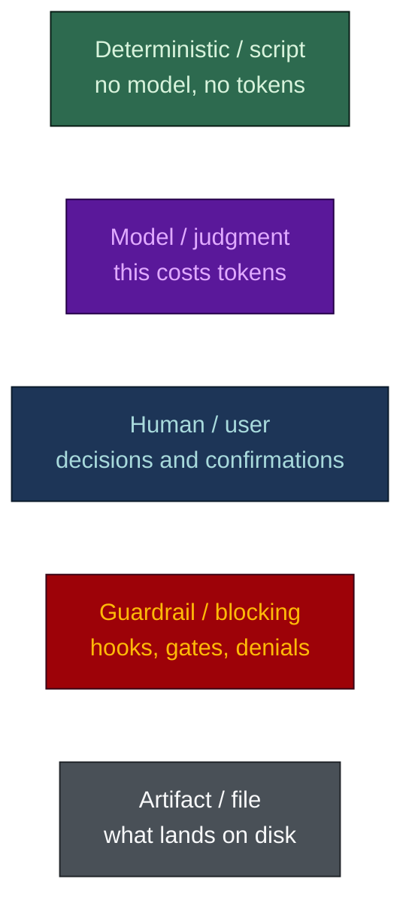
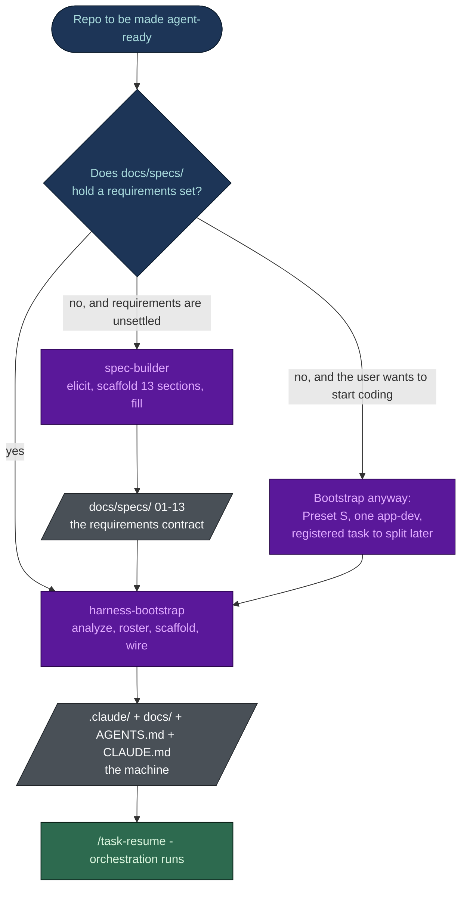
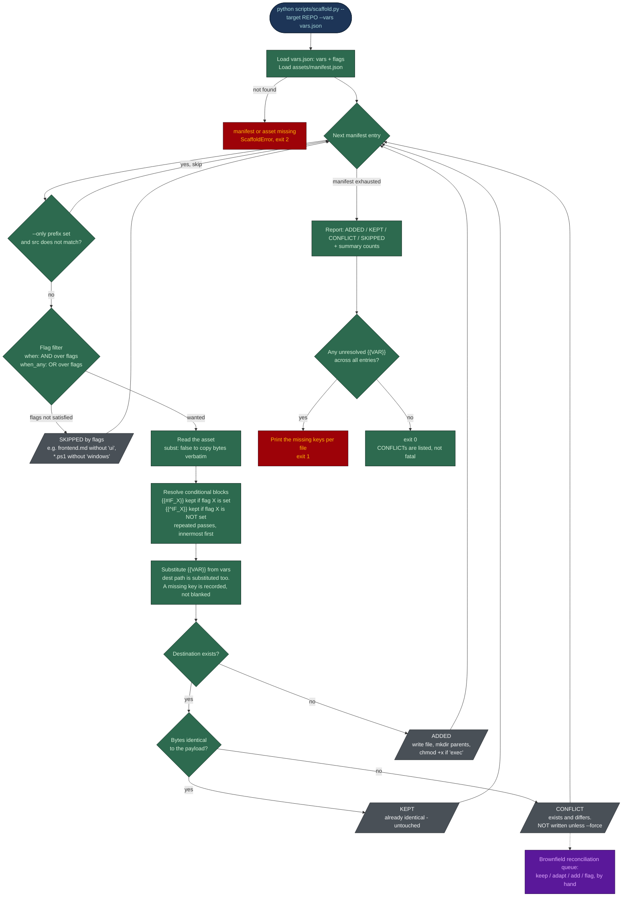
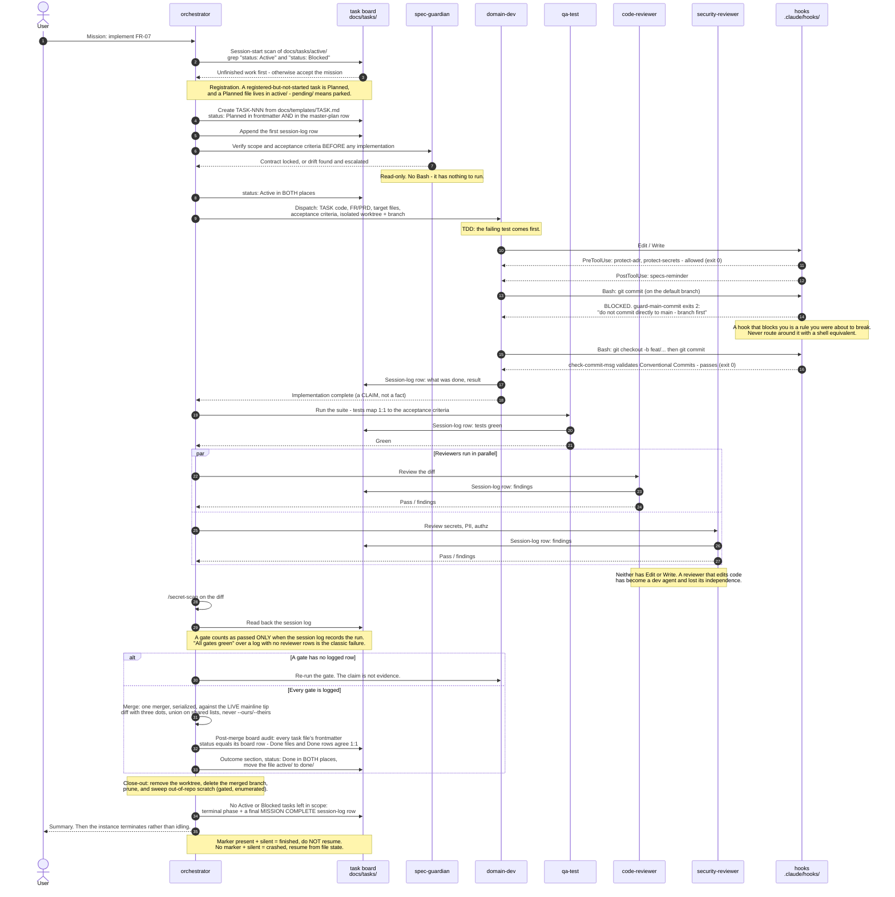
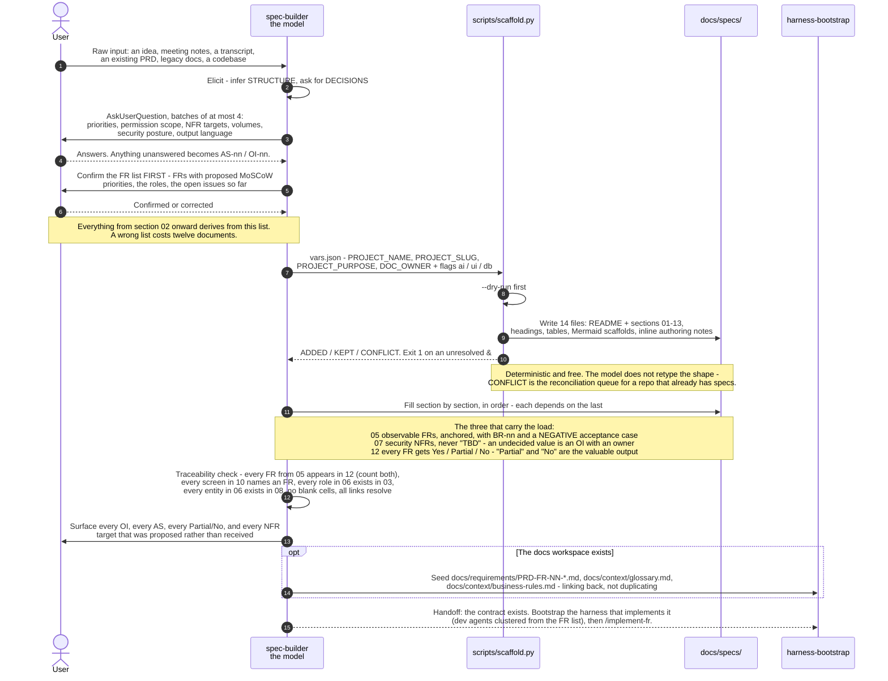
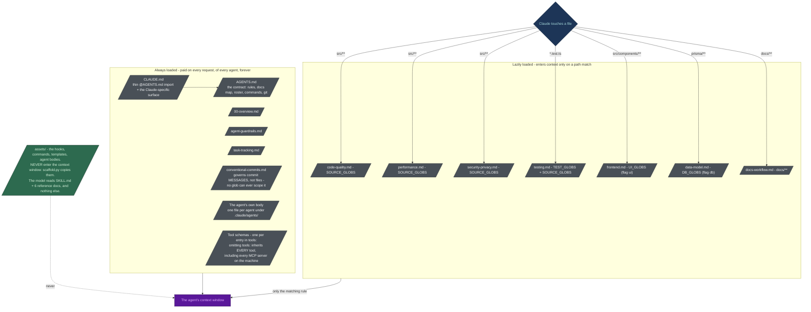

# Flows

Visual reference for the two skills in this repo: `spec-builder`, which produces the requirements
contract, and `harness-bootstrap`, which builds the machine that implements it.

Every diagram below is Mermaid and renders natively on GitHub. The claims in them are taken from the
source: `harness-bootstrap/SKILL.md`, its `reference/` docs, `scripts/scaffold.py`,
`assets/manifest.json`, `assets/claude/settings.json`, `spec-builder/SKILL.md`, and
`benchmark/RESULTS.md`.

## Legend

The colours carry meaning: **green is free, purple is billed**. A step is green when a script does it
deterministically for zero tokens, and purple when a model has to think about it. `harness-bootstrap`
moves as much of the work as possible from purple to green: the assets are real files copied by
`scaffold.py`, not 1,300 lines of prose for a model to retype.

Mermaid applies `classDef` to flowcharts only, not to sequence diagrams. The two sequence diagrams
below therefore carry the same semantics in their prose and notes rather than in fills.

## 1. Overall system flow - how the two skills relate

`spec-builder` writes the contract; `harness-bootstrap` builds the machine that implements it. They
are separate skills because they answer different questions: *what must be true* versus *who builds
it, under what guardrails, at what cost*. The decision point is whether `docs/specs/` already holds a
requirements set. If it does, go straight to `harness-bootstrap`. If it does not, either run
`spec-builder` first, or bootstrap with a single `app-dev` and register a task to split it once
modules emerge. `harness-bootstrap` does not require specs to exist; it fields a smaller roster when
they do not.

The dependency runs one way. `spec-builder` writes into a docs tree that `harness-bootstrap` creates,
so on a repo with no docs tree at all, `harness-bootstrap` runs first and `spec-builder` fills the
`docs/specs/` folder it made. Once section 03 (glossary) and section 05 (functional requirements) are
filled, `spec-builder` also seeds `docs/requirements/PRD-FR-NN-*.md`, `docs/context/glossary.md`, and
`docs/context/business-rules.md` - seeding, not duplicating: the spec section remains the source of
truth and the context files link back to it.

## 2. harness-bootstrap, end to end

Read it as three bands: a **purple** analysis and decision phase where a model is required, a
**green** scaffolding step where a script does the bulk copying for free, and a second **purple**
phase for the things no template can know - the routing table, each dev agent's scope, the real deny
commands. The `CONFLICT` branch out of the scaffolder is not an error path: it is the brownfield
reconciliation queue, and it is why the scaffolder never overwrites a file the user wrote.

```mermaid
flowchart TD
    START(["User invokes /harness-bootstrap"])
    MODE{"Mode"}

    GF["Greenfield<br/>empty or near-empty repo"]
    BF["Brownfield<br/>source exists, agents will modify it"]
    AU["Audit<br/>agents analyze, a human applies fixes"]

    ANALYZE["Codebase analysis - MANDATORY<br/>stack, modules, data layer, integrations,<br/>conventions, risky ops, existing .claude/, git reality"]
    INV[/"Inventory Report<br/>mapping tables: modules to dev agents,<br/>conventions to rules, risky ops to deny and hooks"/]
    CONFIRM{"User confirms<br/>or corrects the report"}

    INTAKE["Intake questionnaire<br/>AskUserQuestion, max 4 per call.<br/>Brownfield: pre-fill from evidence, ask only<br/>what code cannot decide"]
    TOOLS["Detect + confirm target tools<br/>scan for .cursor/ .codex/ AGENTS.md,<br/>then ask: Claude Code / Cursor / Codex"]
    PLAN{"One-screen setup plan:<br/>created / kept / modified,<br/>roster with model + effort.<br/>User confirms"}

    ROSTER["Pick the roster<br/>Tier 0 unconditional, preset S/M/L,<br/>explicit model: AND effort: on every agent"]
    OS["Detect the dev OS<br/>Windows to .ps1, macOS or Linux to .sh<br/>sets the windows / posix flag"]
    VARS[/"vars.json<br/>vars + flags: ui, db, ai, audit,<br/>exactly one of windows / posix"/]

    DRY["scaffold.py --dry-run"]
    SCAFFOLD["scaffold.py<br/>deterministic copy of assets/"]

    ADDED[/"ADDED<br/>file did not exist"/]
    KEPT[/"KEPT<br/>exists and is byte-identical"/]
    CONFLICT[/"CONFLICT<br/>exists and differs - not written"/]
    MISSINGVAR["Unresolved {{VAR}}<br/>exit 1 - fails loudly"]

    RECONCILE["Reconcile by hand:<br/>keep / adapt / add / flag.<br/>Never clobber what the user wrote"]

    GAPFILL["Model-authored gap-fill<br/>orchestrator routing table, dev-agent scopes,<br/>tech-stack.md, coding-standards.md, git-workflow.md,<br/>settings.json allow/deny for the real stack, .env.example"]
    WIRE["Orchestration wiring<br/>master-plan index table, Phase 1 seeded from the<br/>analysis gap list, AGENTS.md entry point,<br/>CLAUDE.md as a thin @AGENTS.md import"]

    GATE{"Quality gate<br/>structure / cost and context / safety /<br/>grounding / handoff"}
    SMOKE["Smoke-test the loop:<br/>real task file, master-plan row,<br/>session-log row, /task-resume"]
    PORT["Port to the tools selected at intake<br/>port.py --tool cursor / codex / all:<br/>.cursor/rules + adapter, .codex/hooks.json"]
    DONE(["Harness runs under orchestration"])

    START --> MODE
    MODE -->|"no source"| GF
    MODE -->|"source, agents may write"| BF
    MODE -->|"source, agents never write"| AU

    GF --> INTAKE
    BF --> ANALYZE
    AU --> ANALYZE
    ANALYZE --> INV --> CONFIRM
    CONFIRM -->|"corrections override findings"| ANALYZE
    CONFIRM -->|"confirmed"| INTAKE

    INTAKE --> TOOLS --> PLAN
    PLAN -->|"changes requested"| INTAKE
    PLAN -->|"confirmed"| ROSTER
    ROSTER --> OS --> VARS
    VARS --> DRY --> SCAFFOLD

    SCAFFOLD --> ADDED
    SCAFFOLD --> KEPT
    SCAFFOLD --> CONFLICT
    SCAFFOLD --> MISSINGVAR
    MISSINGVAR -->|"add the var, re-run"| VARS

    CONFLICT --> RECONCILE
    ADDED --> GAPFILL
    KEPT --> GAPFILL
    RECONCILE --> GAPFILL

    GAPFILL --> WIRE --> GATE
    GATE -->|"a check fails"| GAPFILL
    GATE -->|"all green"| SMOKE --> PORT --> DONE

    classDef det fill:#2D6A4F,stroke:#081C15,stroke-width:1px,color:#D8F3DC
    classDef mod fill:#5A189A,stroke:#240046,stroke-width:1px,color:#E0AAFF
    classDef hum fill:#1D3557,stroke:#0B1B2B,stroke-width:1px,color:#A8DADC
    classDef gate fill:#9D0208,stroke:#370617,stroke-width:1px,color:#FFBA08
    classDef art fill:#495057,stroke:#212529,stroke-width:1px,color:#F8F9FA

    class ANALYZE,INTAKE,TOOLS,ROSTER,OS,GAPFILL,WIRE,RECONCILE mod
    class DRY,SCAFFOLD,SMOKE,PORT det
    class START,MODE,CONFIRM,PLAN,GF,BF,AU,DONE hum
    class GATE,MISSINGVAR gate
    class INV,VARS,ADDED,KEPT,CONFLICT art
```

Three points from the diagram:

- **Mode is chosen first, and it is not about size.** If agents will never modify the source and a
  human applies every fix, the mode is audit however much code exists; otherwise any source code at
  all means brownfield.
- **The Inventory Report gates everything.** In brownfield and audit it is mandatory, it must be
  shown to the user, and its mapping tables are what turn a generic template into a description of
  this specific codebase. No file is generated before it is confirmed.
- **CONFLICT is a queue, not a failure.** The scaffolder skips those files, prints them, and exits 0.
  Only an unresolved `{{VAR}}` makes it exit non-zero, because a placeholder shipped into a live rule
  file matches nothing and fails silently.

### 2a. Where each artifact comes from, and how the artifacts hold each other

The flowchart above is the procedure. The picture below is the *derivation*: which source each
generated file traces back to - the codebase, the specs, or an intake answer - and, once generated,
how the pieces rein each other in. Read the top panel left to right, and the bottom panel as a ring.

  

Two claims it makes that the flowchart above does not. First, the model authors only what cannot be
templated: the routing table, each dev agent's scope, and the three project-specific rules
(`tech-stack`, `coding-standards`, `git-workflow`). Everything else is a file copy. Second, no seat is
trusted - the orchestrator routes but has no Write outside `docs/` and `.claude/`, the reviewers gate
but hold no `Edit` or `Write`, the board records what the session log can prove, and the hooks bind
every agent including the one dispatching them.

## 3. The scaffolder in detail

`scripts/scaffold.py` is stdlib-only, has no dependencies, and is what makes the skill cheap: it
copies real asset files instead of asking a model to regenerate them. It walks `assets/manifest.json`
once, entry by entry. Everything it does is mechanical, which is why the diagram is green apart from
the two places where it refuses to guess.

The scaffolder refuses two decisions on purpose:

- It **never overwrites.** An existing file that differs is reported and left alone, because on a
  brownfield repo the differing file is usually something a human wrote. Use `--force` for files you
  have explicitly decided to replace.
- It **fails on an unresolved variable** rather than writing a literal `{{DB_RESET_CMD}}` into a deny
  rule that would then never match anything.

Re-running on an unchanged repo is idempotent: everything comes back `KEPT`, nothing is clobbered.

## 4. One feature, end to end through the generated harness

This is the flow the generated `.claude/` folder exists to run. The orchestrator is the only entry
point for multi-step work; the specialists are dispatched, not driven by hand. In cost terms: the
orchestrator, the reviewers, and the debugger are Opus seats; the dev agents, `qa-test`, and
`spec-guardian` are Sonnet; the mechanical seats (`history-tracker`, `db-seeder`) are Haiku at `low`
effort. The hooks cost nothing, being shell scripts rather than a model, and they are the only
participant here that can say no.

The files are the truth and an agent's report is a claim. A gate is passed when the task file's
session log holds a row for it, not when an agent says "reviewed". Status lives in two places, the
task file's frontmatter and the master-plan row, and every status change writes both in the same
step, because a merge that resolves a board collision by taking one side reverts a status flip with
no error at all. The hooks are the hard edge: `PreToolUse` fires before the tool runs, exit 2 blocks
it, and the message on stderr goes back to the model. The `MISSION COMPLETE` marker makes "finished"
distinguishable from "crashed" by a file check instead of a guess.

## 5. spec-builder

Same shape, different contract: elicit what only a human knows, let the script lay down the thirteen
sections, then spend model tokens on the content rather than on the headings. The governing rule is
that **nothing is invented**. An unstated requirement becomes an assumption (AS-nn) or an open issue
(OI-nn) with a named owner, because a plausible invented requirement gets estimated, built, and
discovered in UAT.

The ordering is a discipline: the FR list is confirmed *before* anything else is written, and the
sections are filled in order because each depends on the last. The traceability check at the end is
mechanical - count the FRs in 05, count the rows in 12, they match - which is the kind of check a
model will skip unless it is written down as a gate.

## 6. Context loading - why the harness is cheap

This is the mechanic behind the numbers in `benchmark/RESULTS.md`. A file in `.claude/rules/` with
**no `paths:` frontmatter** loads at launch, into every session of every agent, at the same priority
as `CLAUDE.md`. It is not a one-time cost, it is rent. Add `paths:` and the rule only enters context
when Claude actually touches a matching file.

Six unconditional rules, eight path-scoped ones. On the shipped asset set that is 25,303 bytes always
loaded against 49,394 bytes loaded on demand: **66% of the rule content is kept out of the default
session**, so the database agent no longer carries the frontend rules and the UI agent no longer
carries the migration-safety rules.

Two other levers sit in the same diagram:

- Every tool in an agent's `tools:` list ships its JSON schema on *every* request. Omitting `tools:`,
  and thereby inheriting every MCP server on the machine, is treated as a bug in the quality gate.
- Every file in the always-loaded band is prompt-cache prefix content, so a single `Generated: <date>`
  line in an agent body cold-misses that agent's cache on every future run. No generated file carries
  a timestamp.

## Accuracy notes

- The byte and file counts above are exact, counted from disk. The token figures in
  `benchmark/RESULTS.md` are **estimated** at 3.6 chars/token, not measured: the benchmark run had no
  API key. They are an order of magnitude, not a quote.
- The orchestrator's session-start scan of `docs/tasks/active/` is a **procedure in the agent body**,
  not a `SessionStart` hook. The hook events registered in `assets/claude/settings.json` are
  `PreToolUse` (protect-adr, protect-secrets, guard-main-commit, check-commit-msg), `PostToolUse`
  (specs-reminder), and `SubagentStop` (agent-history). Diagram 4 shows the scan as an orchestrator
  action for that reason.
- `CONFLICT` does **not** change the scaffolder's exit code. Only an unresolved `{{VAR}}` (exit 1) or
  a missing manifest/asset (exit 2) does. Diagram 3 reflects the code.
- The `merge-manager` seat is optional and is omitted from diagram 4. Where it is not fielded, the
  orchestrator merges and applies the same rules itself.
