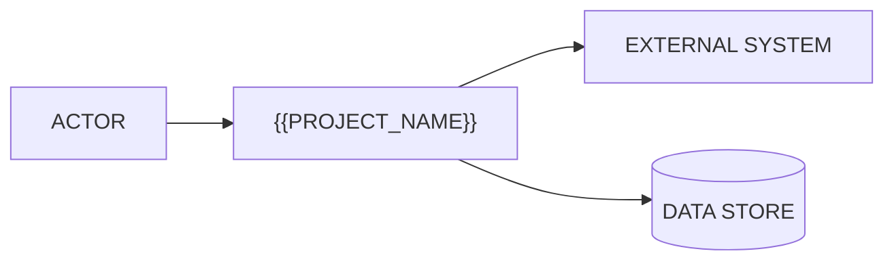

# Overview

## Context

<!-- Where this system sits in the organisation and in the existing tool landscape. What exists
     today, who runs it, and what changed that made this project necessary. Two or three
     paragraphs. If you cannot answer "why now", ask - do not invent a trigger. -->

{{PROJECT_PURPOSE}}

## Problem statement

<!-- The problem as the business experiences it, not as the solution implies it. Who is hurt, how
     they work around it today, and what the workaround costs (time, money, error rate, risk).
     Quantify wherever the input gives you a number; where it does not, say "not quantified" - do
     not estimate on the stakeholder's behalf. -->

| Aspect | Today |
|--------|-------|
| Who is affected | <role or team> |
| Current process | <how it is done now, including the spreadsheet nobody admits to> |
| Cost of the status quo | <time, money, error rate, or "not quantified"> |
| Trigger for change | <what made this urgent now> |

## Goals

<!-- What is true after this ships. Each goal is observable. A goal with no metric is a wish, and a
     wish cannot be signed off. -->

| ID | Goal | Rationale |
|----|------|-----------|
| G-01 | <goal, stated as an outcome> | <why it matters to the business> |

## Non-goals

<!-- What this project explicitly will NOT do, so the boundary is a decision instead of an
     oversight. This list prevents more rework than any other list in the spec set. -->

- <thing a reasonable person might assume is included, and is not>

## Scope

### In scope

- <capability, linked to its FR once 05 exists: [FR-01](05-functional-requirements.md#fr-01)>

### Out of scope

- <capability deliberately excluded, with the reason, and where it might land later>

## Success metrics

| Metric | Baseline (today) | Target | How it is measured |
|--------|------------------|--------|--------------------|
| <metric> | <today's value, or "unknown - OI-nn"> | <target> | <the query, report, or instrument> |

<!-- An unknown baseline is an open issue, not a blank cell. Register it in
     11-assumptions-constraints.md and link the OI id here. -->

## System context

<!-- One diagram: the system as a box, the actors around it, the external systems it talks to.
     Detail belongs in 04 (flows) and 09 (integrations) - this is the one-screen orientation. -->

{{#IF_AI}}
## AI in this system

<!-- State plainly what the model does and what it does not. The line between "AI proposes" and
     "AI decides" is a business decision, not a technical one - if the input does not settle it,
     it is an open issue, not an assumption you get to make. -->

| Question | Answer |
|----------|--------|
| What the model produces | <output, and its form> |
| Who or what consumes it | <human reviewer, downstream system> |
| Is a human in the loop | <yes/no, and at which step> |
| What happens when it is wrong | <the fallback, the correction path> |
| Untrusted content reaching the model | <user uploads, third-party text - see [NFR-SEC](07-non-functional-requirements.md#nfr-security)> |
{{/IF_AI}}

## References

- <source material this section was derived from: transcript, PRD, legacy doc, meeting date>
