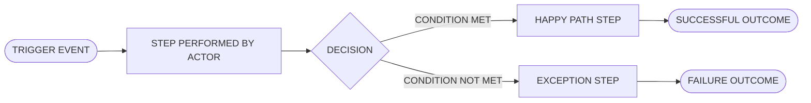
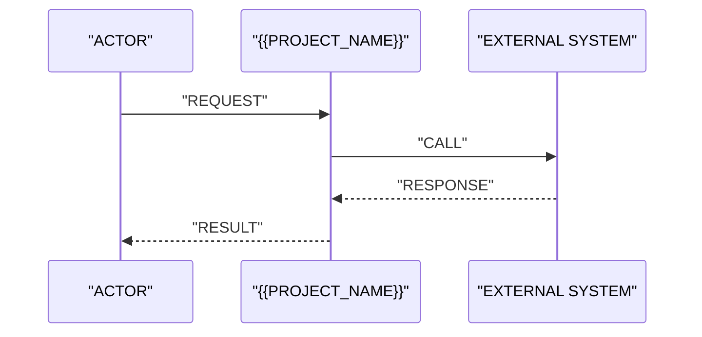

# Business flows

<!-- The processes as the business runs them, end to end, including the steps that happen outside
     the system. A flow that starts at the login screen is a UI walkthrough, not a business flow -
     start where the work actually starts (an email arrives, a customer calls, a deadline passes).

     Diagram rules: Mermaid only. Node labels in double quotes. LR for process flows, TD for
     hierarchies. Every decision node has a labelled edge for every branch, including the sad one. -->

## Flow index

| ID | Flow | Trigger | Primary actor | Serves |
|----|------|---------|---------------|--------|
| BF-01 | <flow name> | <what starts it> | <role> | [FR-01](05-functional-requirements.md#fr-01) |

## BF-01 <flow name>

**Trigger**: <the event that starts this flow, in the real world>
**Actors**: <roles from [02](02-stakeholders.md)>
**Preconditions**: <what must already be true>
**Outcome (success)**: <what is true when it ends well>
**Outcome (failure)**: <what is true when it does not, and who is left holding it>

### Steps

| # | Actor | Action | System behaviour | Requirement |
|---|-------|--------|------------------|-------------|
| 1 | <role> | <what the person does> | <what the system does in response> | [FR-01](05-functional-requirements.md#fr-01) |

### Exceptions and edge cases

<!-- The branches that make estimates wrong when they are discovered late: the rejection, the
     timeout, the duplicate submission, the person who leaves the company mid-approval. If the
     input does not say what happens, that is an open issue - not a branch you may design. -->

| Condition | What happens | Requirement or open issue |
|-----------|--------------|---------------------------|
| <exception> | <handling, or "undecided"> | [OI-01](11-assumptions-constraints.md#oi-01) |

## Cross-flow interaction

<!-- Only if flows hand off to each other. A sequence diagram is the right tool when the question
     is "who calls whom, in what order"; a flowchart is the right tool when the question is "what
     happens next". Do not draw both for the same content. -->

## Process changes introduced by this system

<!-- What people will stop doing, start doing, or do differently. Change that is not written down
     here is change that hits the users on launch day. -->

| Step today | Step after launch | Who is affected |
|------------|-------------------|-----------------|
| <manual step> | <automated or changed step> | <group from [02](02-stakeholders.md)> |
