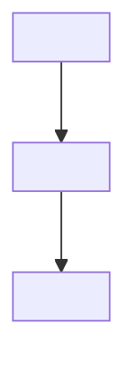

# Access control

<!-- Who may do what, to which records. The two questions are separate and both must be answered:
     the ACTION (create, read, update, delete, approve) and the SCOPE (their own records, their
     team's, everyone's). A matrix that answers only the first leaks data on the day the second
     user signs in.

     Role names here must match [03-glossary.md](03-glossary.md) exactly. -->

## Roles

| Role (English, canonical) | Description | Held by (from [02](02-stakeholders.md)) | Assigned by |
|---------------------------|-------------|----------------------------------------|-------------|
| `<role_name>` | <what this role exists to do> | <group> | <who grants it> |

## Permission matrix

<!-- One row per entity from [08](08-data-model.md), one column pair per role. Cell format:
     the operations allowed, then the scope in parentheses.
       C R U D  = create / read / update / delete
       (Own)    = only records the user created or is assigned to
       (Team)   = records belonging to their unit
       (All)    = every record
       -        = no access
     Never leave a cell blank. A blank cell is read as "allowed" by whoever implements it. -->

| Entity | `<role_a>` | `<role_b>` | `<role_admin>` |
|--------|-----------|-----------|----------------|
| `<Entity>` | CRU (Own) | R (Team) | CRUD (All) |
| `<Entity2>` | R (Own) | - | CRUD (All) |

## Action permissions

<!-- Operations that are not plain CRUD: approve, publish, export, re-run, impersonate,
     bulk-delete. These are where privilege escalation actually happens, and they are almost never
     covered by the CRUD matrix. -->

| Action | Entity | Allowed roles | Condition | Requirement |
|--------|--------|---------------|-----------|-------------|
| Approve | `<Entity>` | `<role>` | <e.g. not the record's own author> | [FR-01](05-functional-requirements.md#fr-01) |
| Export | `<Entity>` | `<role>` | <what is redacted in the export> | [FR-02](05-functional-requirements.md#fr-02) |

## Data scope rules

<!-- State the filter, not the intention. "Managers see their team" is an intention; "rows where
     record.owner.unit_id = user.unit_id" is a filter an engineer can implement and a reviewer can
     check. -->

| Scope | Definition |
|-------|-----------|
| Own | <the exact predicate> |
| Team | <the exact predicate> |
| All | <any exclusions - e.g. soft-deleted records> |

## Authentication

| Question | Answer |
|----------|--------|
| Identity provider | <SSO provider, local accounts, or "undecided - OI-nn"> |
| Session lifetime | <duration, and what ends it> |
| Multi-factor | <required for which roles> |
| Service-to-service | <how [09](09-integration-interface.md) callers authenticate> |

<!-- If the identity provider is not decided, that is an open issue, not a placeholder to be filled
     with whatever the team used last time. Register it in 11. -->

## Role hierarchy

<!-- Only if roles inherit. Inheritance is convenient and is how an admin quietly gains a
     permission nobody granted - draw it so the inheritance is visible and reviewable. TD for
     hierarchies. -->

## Auditing

<!-- Which actions leave a trail, who can read it, and how long it is kept. Access to the audit log
     is itself a permission - put it in the matrix above. -->

| Action | Logged | Retention | Readable by |
|--------|--------|-----------|-------------|
| <privileged action> | Yes | <period, per [NFR-SEC](07-non-functional-requirements.md#nfr-security)> | `<role>` |

## Open points

- <e.g. "Delegation during leave is undefined - see [OI-02](11-assumptions-constraints.md)">
