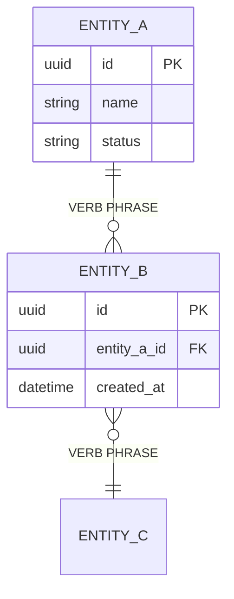
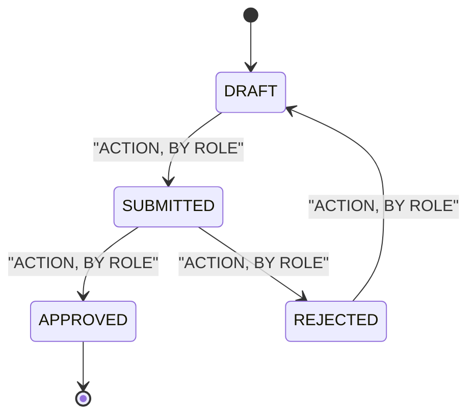

# Data model

<!-- The conceptual model: the entities the business talks about and how they relate. This is not
     the physical schema - no index strategy, no partitioning, no ORM decisions. Those belong in
     an ADR under docs/architecture/, made by whoever builds it.

     Entity and field names are ALWAYS English, whatever language this prose is in. They become
     table and column names, and a mixed-language schema is a permanent tax. -->

## Entity relationship diagram

<!-- Cardinality is a business fact, not a modelling preference. "One order has many lines" is
     safe; "one customer has one address" is the kind of assumption that gets discovered during
     UAT. Where the input does not settle the cardinality, mark it and register an open issue. -->

## Entities

| Entity | Represents | Owner (role) | Volume estimate | Retention |
|--------|-----------|--------------|-----------------|-----------|
| `<Entity>` | <the business thing, in one sentence> | `<role>` | <rows at launch / per year> | <per [NFR-SEC-19](07-non-functional-requirements.md#nfr-security)> |

## Data dictionary

### `<Entity>`

<!-- One table per entity. Classification is not optional - it is what
     [NFR-SEC-01](07-non-functional-requirements.md#nfr-security) is checked against, and a field
     with no classification is a field nobody protected. -->

| Field | Type | Required | Classification | Description | Example |
|-------|------|----------|----------------|-------------|---------|
| `id` | uuid | Yes | Internal | Primary key | `<example>` |
| `<field>` | `<type>` | Yes / No | Public / Internal / Confidential / PII / Sensitive PII | <what it means to the business> | `<realistic but fictional value>` |
| `status` | enum | Yes | Internal | <see the enum table in [03](03-glossary.md)> | `DRAFT` |
| `created_at` | datetime | Yes | Internal | <when the record was created> | `<example>` |

**Constraints and invariants**

<!-- The rules the data must always satisfy, regardless of which code path wrote it. Each one
     should be traceable to a business rule in [05](05-functional-requirements.md). -->

- <e.g. "`status` moves only along the transitions in [03](03-glossary.md) - see BR-01">
- <e.g. "`<field>` is unique per `<parent>`">

### `<Entity2>`

| Field | Type | Required | Classification | Description | Example |
|-------|------|----------|----------------|-------------|---------|
| `id` | uuid | Yes | Internal | Primary key | `<example>` |

**Constraints and invariants**

-

## State transitions

<!-- Only for entities whose lifecycle matters (an order, a claim, a document). A state machine
     drawn here is a state machine QA can test; a state machine held in three people's heads is a
     bug per person. -->

| From | To | Trigger | Allowed role | Rule |
|------|----|---------|--------------|------|
| `DRAFT` | `SUBMITTED` | <action> | `<role>` | [BR-01](05-functional-requirements.md#fr-01) |

{{#IF_DB}}
## Persistence notes

<!-- Facts that bind the implementation, not the implementation itself. If the choice has not been
     made, say so and register it - do not default to the database the last project used. -->

| Question | Answer |
|----------|--------|
| Store | <engine, or "undecided - [OI-nn](11-assumptions-constraints.md)"> |
| Migration path | <existing data to migrate? volume? source system?> |
| Soft delete | <does the domain need history, or is a delete a delete?> |
| Auditing | <which entities keep a change history, per [06](06-access-control.md)> |
{{/IF_DB}}

## Data sources and migration

<!-- Where the data comes from on day one. An empty database at launch is a business decision;
     assume it only if someone said it. -->

| Entity | Source at launch | Volume | Owner of the migration |
|--------|------------------|--------|------------------------|
| `<Entity>` | <legacy system, spreadsheet, or "created in-app"> | <rows> | <role> |

## Open points

- <cardinalities, retention periods, or classifications the input did not settle, linked to [11](11-assumptions-constraints.md)>
