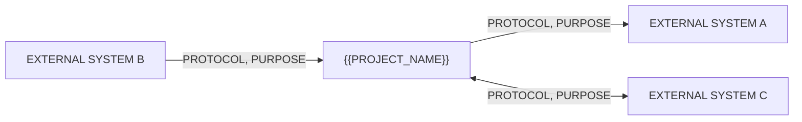

# Integration interface

<!-- Every boundary the system talks across. Each one is a place where the project can be blocked
     by someone who does not work here - which is why the "owner" and "environment availability"
     columns matter more than the protocol column.

     An integration nobody has confirmed exists is an assumption, not a design. Register it in
     [11](11-assumptions-constraints.md) until someone with access says yes. -->

## Integration map

## Integration table

| ID | Interface | Direction | Protocol | Data exchanged | Auth | Frequency | Owner |
|----|-----------|-----------|----------|----------------|------|-----------|-------|
| INT-01 | <system name> | Outbound / Inbound / Bidirectional | REST / SOAP / file / queue / webhook | <what crosses the boundary> | <OAuth2 / API key / mTLS> | <realtime / hourly / on demand> | <team that owns the other side> |

## INT-01 <system name>

**Purpose**: <why this integration exists, in business terms>
**Serves**: [FR-01](05-functional-requirements.md#fr-01)
**Owner of the far side**: <team, and the named contact>

### Contract

| | Detail |
|---|---|
| Endpoint | <URL pattern, or "provided per environment"> |
| Method / operation | <GET/POST, or the operation name> |
| Request payload | <fields, and which are required> |
| Response payload | <fields consumed - and only those> |
| Data classification | <per [07](07-non-functional-requirements.md#nfr-security) - what leaves our boundary> |
| Idempotency | <can the call be safely retried? what makes it idempotent?> |
| Rate limits | <the far side's limit, and what we do at it> |

### Authentication

| | Detail |
|---|---|
| Mechanism | <OAuth2 client credentials / API key / mTLS> |
| Credential storage | <the secret store, per [NFR-SEC-08](07-non-functional-requirements.md#nfr-security)> |
| Rotation | <who rotates, how often> |

### Failure behaviour

<!-- The section that gets skipped and then written at 2am during an incident. What the user sees,
     what the system does, and what state the data is left in - for each way this can fail. -->

| Failure | System behaviour | User-visible effect | Data state |
|---------|------------------|---------------------|------------|
| Timeout | <retry policy: how many, what backoff, then what> | <what the user sees> | <consistent? pending? needs reconciliation?> |
| 4xx (rejected) | <no retry - surface, log, alert?> | | |
| 5xx (far side down) | <retry / queue / degrade per [NFR-REL-04](07-non-functional-requirements.md#nfr-reliability)> | | |
| Malformed response | <fail closed - never guess at the missing field> | | |

### Environment availability

<!-- The question that decides your test plan: is there a sandbox? If the answer is "we test
     against production", that is a risk for [12](12-technical-feasibility.md), not a detail. -->

| Environment | Available | Notes |
|-------------|-----------|-------|
| Development | Yes / No / Unknown | <sandbox URL, or the mock we must build instead> |
| Staging | Yes / No / Unknown | |
| Production | Yes | |

## Interfaces this system exposes

<!-- If other systems call us. The same discipline applies in reverse: our contract, our auth, our
     rate limits, and what we promise when we are degraded. -->

| ID | Endpoint | Consumer | Auth | Data returned | Rate limit |
|----|----------|----------|------|---------------|------------|
| API-01 | <path> | <system or team> | <mechanism> | <fields, and their classification> | <limit> |

## Open points

- <integrations that were mentioned but not confirmed, and every "Unknown" above, linked to [11](11-assumptions-constraints.md)>
