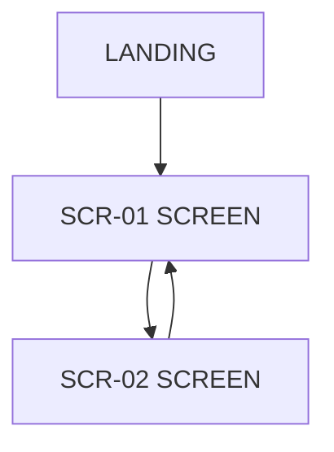

# UI/UX wireframes

<!-- A screen that serves no requirement is scope creep; a requirement with no screen is either a
     background job or a gap. The "Serves" column is what makes this section a specification rather
     than a mood board.

     Wireframes here are structural, not visual: what is on the screen, what a user can do, and
     what happens when it goes wrong. Colour, type, and spacing belong to design, not to the
     requirements contract. -->

{{^IF_UI}}
<!-- This system has no user interface flagged. Keep the file: record here how users or operators
     interact with the system instead (CLI, API, scheduled job, admin console of another product),
     and delete the screen sections below. A system with no UI still has a surface someone
     operates - specify it. -->
{{/IF_UI}}

## Screen inventory

| ID | Screen | Actor | Serves | Entry point |
|----|--------|-------|--------|-------------|
| SCR-01 | <screen name> | `<role>` | [FR-01](05-functional-requirements.md#fr-01) | <where the user comes from> |
| SCR-02 | <screen name> | `<role>` | [FR-02](05-functional-requirements.md#fr-02) | <where the user comes from> |

## Navigation

<!-- How a user gets from anywhere to anywhere. TD for a hierarchy; LR when it is a linear task
     flow. If the map has an orphan node, either navigation is missing or the screen is. -->



## SCR-01 <screen name>

**Actor**: `<role>` (see [06](06-access-control.md) for what they may do here)
**Serves**: [FR-01](05-functional-requirements.md#fr-01)
**Entities shown**: `<Entity>` (see [08](08-data-model.md))

### Layout

<!-- A structural sketch. ASCII, a Mermaid block, or a list of regions - whatever communicates the
     hierarchy. Do not paste a screenshot of a product that already exists and call it a spec. -->

```
+--------------------------------------------------+
| <header: title, primary action>                  |
+--------------------------------------------------+
| <filters / search>                               |
+--------------------------------------------------+
| <main region: what is listed, and in what order> |
|                                                  |
+--------------------------------------------------+
```

### Elements

| Element | Type | Bound to | Behaviour | Visible to |
|---------|------|----------|-----------|------------|
| <field name> | input / select / table / button | `<Entity>.<field>` | <validation, per [FR-01](05-functional-requirements.md#fr-01)> | `<role>` |
| <primary action> | button | - | <what it does; is it irreversible?> | `<role>` |

<!-- "Visible to" is not a substitute for authorisation - hiding a button is a convenience, and the
     server still enforces [NFR-SEC-05](07-non-functional-requirements.md#nfr-security). But the
     column must be filled, because a control shown to a user who cannot use it is a support
     ticket. -->

### States

<!-- Every screen has more than the happy state, and the ones below are where the requirement
     actually lives. An unspecified empty state gets built as a blank page. -->

| State | What the user sees |
|-------|--------------------|
| Empty (no data yet) | <the message, and the action that gets them out of it> |
| Loading | <skeleton, spinner, or nothing - and after how long> |
| Error | <what went wrong, and what they can do about it, per [NFR-USE-04](07-non-functional-requirements.md#nfr-usability)> |
| No permission | <hidden, or shown-and-disabled with a reason> |
| Success | <confirmation, and where they land next> |

{{#IF_AI}}
### Model-assisted elements

<!-- Where the screen shows something a model produced. The user must be able to tell what was
     generated, how sure the system is, and how to correct it - that is a requirement, not a
     nicety. -->

| Element | What the model produced | How it is labelled | How the user corrects it |
|---------|------------------------|--------------------|--------------------------|
| <element> | <suggestion, draft, ranking> | <the visible indication that this is generated> | <edit, reject, regenerate - and what is recorded> |

- Waiting behaviour: <what the user sees while the model runs, and the timeout>
- Failure behaviour: <what the screen does when the model returns nothing usable>
{{/IF_AI}}

## SCR-02 <screen name>

<!-- Copy the SCR-01 block. -->

**Actor**: `<role>`
**Serves**: [FR-02](05-functional-requirements.md#fr-02)
**Entities shown**: `<Entity>`

### Layout

### Elements

| Element | Type | Bound to | Behaviour | Visible to |
|---------|------|----------|-----------|------------|
| | | | | |

### States

| State | What the user sees |
|-------|--------------------|
| Empty | |
| Loading | |
| Error | |
| No permission | |
| Success | |

## Cross-cutting UI rules

| Concern | Rule |
|---------|------|
| Responsive breakpoints | <the devices that are actually supported> |
| Accessibility | <per [NFR-USE-02](07-non-functional-requirements.md#nfr-usability)> |
| Language | <UI languages; labels are localised, codes and enums stay English> |
| Destructive actions | <confirmation required for: ...> |

## Coverage check

<!-- Run this before review. Both directions, every time. -->

- [ ] Every screen names at least one FR it serves.
- [ ] Every FR with a user-facing surface names at least one screen.
- [ ] Every screen's actor holds a role that exists in [06](06-access-control.md).
