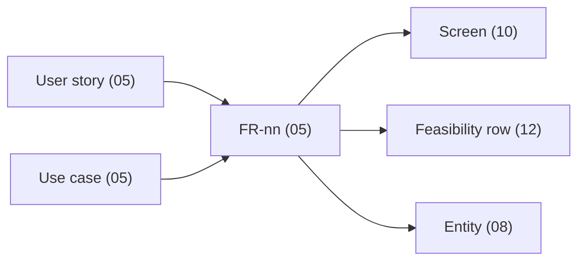

# Specifications - {{PROJECT_NAME}}

{{PROJECT_PURPOSE}}

This directory is the requirements contract for {{PROJECT_NAME}}. Code that disagrees with a section
here is either a bug or an undocumented decision; find out which. Nothing in these documents is
invented - anything not stated by a stakeholder or clearly implied by source material lives in
[11-assumptions-constraints.md](11-assumptions-constraints.md) as an open issue with an ID.

## Contents

| # | Section | What it answers |
|---|---------|-----------------|
| 01 | [Overview](01-overview.md) | Why the system exists, what is in and out of scope, how success is measured |
| 02 | [Stakeholders](02-stakeholders.md) | Who cares, who decides, who is affected |
| 03 | [Glossary](03-glossary.md) | The domain vocabulary - one term, one meaning |
| 04 | [Business flows](04-business-flows.md) | How work moves through the system end to end |
| 05 | [Functional requirements](05-functional-requirements.md) | What the system must do (FR-nn), plus use cases and user stories |
| 06 | [Access control](06-access-control.md) | Roles and the permission matrix |
| 07 | [Non-functional requirements](07-non-functional-requirements.md) | Performance, security, reliability, usability, scalability |
| 08 | [Data model](08-data-model.md) | Entities, relationships, and the data dictionary |
| 09 | [Integration interface](09-integration-interface.md) | External systems, protocols, and auth |
| 10 | [UI/UX wireframes](10-ui-ux-wireframes.md) | Screens, and the requirements each one serves |
| 11 | [Assumptions and constraints](11-assumptions-constraints.md) | What we assumed, what binds us, what is still open |
| 12 | [Technical feasibility](12-technical-feasibility.md) | Can each requirement actually be built, and at what risk |
| 13 | [Revision history](13-revision-history.md) | What changed, when, and by whom |

## Reading guide

- **New to the project**: 01, then 03, then 04. Twenty minutes gets you the shape of the domain.
- **Building a feature**: 05 for the FR, 06 for who may call it, 08 for the entities it touches,
  10 for the screen. The FR is the entry point; everything else links back to it.
- **Reviewing scope or cost**: 01 (scope), 12 (feasibility), 11 (open issues). Every "No" or
  "Partial" in 12 is a scope conversation waiting to happen.
- **Security review**: 06 and 07. The security NFRs are mandatory and are never "TBD".

## ID schemes

| Prefix | Lives in | Example |
|--------|----------|---------|
| `FR-nn` | 05 | `FR-01`, anchored `{#fr-01}` |
| `NFR-XXX-nn` | 07 | `NFR-SEC-01`, `NFR-PERF-02` |
| `UC-xx` | 05 | `UC-01` |
| `US-xx` | 05 | `US-01` |
| `BR-xx` | 05 | `BR-01` |
| `AS-xx` | 11 | `AS-01` (assumption) |
| `OI-xx` | 11 | `OI-01` (open issue) |

IDs are stable. A requirement that is dropped keeps its ID and is marked withdrawn; it is never
reused, because a task, a commit, and a test somewhere still name it.

## Traceability

Every functional requirement is reachable from five directions, and each link is a relative path
plus an anchor:

If an FR is missing from 12, or a screen serves no FR, the set is broken - fix it before review.

<!-- Authoring: keep this README last-updated by hand. Do not add a generated-on date; these files
     are prompt-cache prefix content and one volatile byte cold-misses the cache downstream. -->
