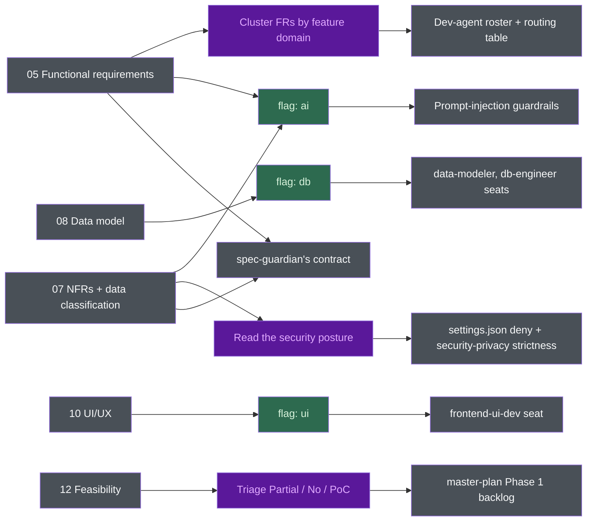

# BA standards - what this structure follows, why, and what it feeds

Three questions this file answers:

1. Which recognised body of practice does each of the thirteen sections come from?
2. Why this shape - thirteen numbered files with stable IDs - and not something else?
3. How is the output ready to be consumed by `harness-bootstrap`?

## The honest framing, before anything else

**This is an opinionated synthesis, not a certified implementation of any single standard.**

No clause of ISO/IEC/IEEE 29148 requires a file named `05-functional-requirements.md`. No auditor will
accept this spec set as evidence of conformance to anything. What the thirteen sections do is borrow
the *content model* of the requirements-engineering standards, the *quality-attribute taxonomy* of
ISO/IEC 25010, the *elicitation and traceability discipline* of BABOK, and the *security verification
posture* of OWASP - and arrange them so that a language model and a team of coding agents can be held
to them.

Where a section follows a standard, the table below says which. Where the structure is a choice made
here, it says "synthesis" and Part 2 argues for it. Both labels are load-bearing: a citation that
overclaims is worse than no citation, because the next reader trusts it.

## Standards cited in this document

**Verified: 2026-07-14.** Each row was checked on that date against the publisher's catalogue page or
project site. The ISO and IEEE standards are paywalled: the *edition, title, and scope* were verified
against the ISO/IEC catalogue and IEEE Xplore, and the characteristic lists against those pages plus
secondary summaries. The full normative text was **not** read. Treat the clause-level detail below as
a faithful summary, not as a quotation.

| Standard | Edition used here | Status | Scope |
|----------|-------------------|--------|-------|
| ISO/IEC/IEEE 29148 | 2018 | Current | Requirements engineering across the life cycle: elicitation, analysis, specification, validation. Defines the SRS content model and the characteristics of a well-formed requirement |
| IEEE 830 | 1998 | **Superseded** by ISO/IEC/IEEE 29148:2011, updated 2018. Still widely used because it is shorter | The SRS document itself: structure, content, and quality characteristics (unambiguous, complete, verifiable, modifiable, traceable, among others) |
| ISO/IEC 25010 | 2023 (2nd ed.) | Current | Product quality model. Nine characteristics. The 2023 edition renamed *usability* to *interaction capability* and *portability* to *flexibility*, and added *safety* |
| BABOK Guide | v3 (IIBA) | Current | Six knowledge areas, including Elicitation and Collaboration, and Requirements Life Cycle Management (traceability, baselining, approval) |
| MoSCoW | DSDM / Agile Business Consortium | Current practice | Prioritisation: Must / Should / Could / Won't. Devised by Dai Clegg (Oracle, 1994), donated to the DSDM Consortium |
| Use cases | Cockburn, *Writing Effective Use Cases* (2001) | Established practice | Primary actor, preconditions, guarantees, main success scenario, extensions |
| User stories + Gherkin | Connextra story format; Gherkin (Cucumber) | Established practice | "As a &lt;role&gt;, I want &lt;capability&gt;, so that &lt;benefit&gt;"; Given / When / Then acceptance criteria |
| C4 model | Simon Brown | Established practice | Context, container, component, code. Only the **context** level is used here |
| arc42 | Current template | Established practice | Architecture documentation template. Only the **context and scope** section is echoed here |
| OWASP ASVS | 5.0.0 (2025-05-30) | Current | Application security verification requirements |
| OWASP Top 10 for LLM Applications | 2025 edition | Current | `LLM01:2025` Prompt Injection, `LLM05:2025` Improper Output Handling, `LLM06:2025` Excessive Agency, and the rest |

The OWASP rows are consistent with the standards table in
`harness-bootstrap/assets/claude/rules/security-privacy.md`, which is the version of record for this
repo and carries its own verification date. If the two ever disagree, that rule file wins - it is what
the security reviewer actually cites.

## Part 1 - Which standard each section draws on

| # | Section | What it is | Draws on | Why it exists |
|---|---------|-----------|----------|---------------|
| 01 | Overview | Context, problem, goals, non-goals, scope, success metrics, system context diagram | 29148 (the SRS "purpose / scope / product perspective" front matter); C4 level 1 and arc42 "context and scope" for the one diagram; BABOK *Strategy Analysis* for the problem-and-goals framing | A requirement set with no stated problem cannot be evaluated - you can only check it for internal consistency, never for whether it solves anything. Non-goals prevent more rework than any other list in the set |
| 02 | Stakeholders | Stakeholder map, influence, decision rights, escalation, sign-off | BABOK *Elicitation and Collaboration* (stakeholder analysis); 29148's stakeholder-requirements stage | A spec with no named decider changes every time a new person reads it. "Decision rights" is the column that ends arguments |
| 03 | Glossary | Domain terms, canonical enum values, role names, term collisions | 29148 (a definitions section is part of the SRS content model); BABOK glossary technique | Synthesis in its emphasis: this is the **anti-hallucination vocabulary**. When a downstream agent invents a plausible synonym, this table is what catches it. The "term collisions" table is not in any standard - it is here because a word meaning two things in two departments is how two teams ship incompatible features while both believing they read the same spec |
| 04 | Business flows | End-to-end processes, triggers, actors, exception branches | BABOK *process modelling*; 29148 concept-of-operations material | The system is a participant in a business process, not the whole of it. A flow that starts at the login screen is a UI walkthrough and hides every step where the work actually goes wrong |
| 05 | Functional requirements | FR-nn with input/output, business rules, acceptance criteria; use cases; user stories; the traceability matrix | 29148 + IEEE 830 (the functional-requirements content model and the characteristics of a good requirement); ISO/IEC 25010 *functional suitability*; Cockburn (the UC block: precondition, postcondition, main scenario, alternates, exceptions); Connextra + Gherkin (the US block and Given/When/Then); MoSCoW (the priority column) | The centre of the set. Everything else links here. 29148's *verifiable* and *singular* characteristics are what the "requirements are observable" rule in `writing-rules.md` operationalises |
| 06 | Access control | Roles, permission matrix (action **and** scope), action permissions, data-scope predicates, auth, audit | OWASP ASVS (access control and session management); 29148 treats this as an interface and security requirement | Split out from 07 deliberately - see Part 2. A matrix that answers "which action" but not "over whose records" leaks data on the day the second user signs in |
| 07 | Non-functional requirements | PERF, SEC, REL, USE, SCA, MNT categories, each with a number and a measurement | **ISO/IEC 25010:2023** for the taxonomy; **OWASP ASVS** and the **OWASP LLM Top 10 (2025)** for the mandatory security content; 29148 for the rule that every requirement is verifiable | See the category mapping below. The security subsections are mandatory and can never be "TBD" - Part 2 states the failure mode |
| 08 | Data model | Conceptual ERD, entities, data dictionary **with a classification column**, state machines | 29148 (information/data requirements); the classification column exists to satisfy ASVS data-protection verification and to feed NFR-SEC-01 | Conceptual, not physical: no indexes, no ORM, no partitioning. Those are ADR decisions made by whoever builds it. The classification column is what makes 07's encryption and retention rules checkable field by field |
| 09 | Integration interface | Per-integration contract, auth, **failure behaviour**, environment availability | 29148 *interface requirements*; C4 context level (the integration map); arc42 context and scope | Every boundary is a place the project can be blocked by someone who does not work here. The "failure behaviour" table is the one that otherwise gets written at 2am during an incident |
| 10 | UI/UX wireframes | Screen inventory, navigation, elements, **states** (empty / loading / error / no-permission / success) | Structural wireframing practice, not a standard; the "Serves" column is 29148/BABOK traceability applied to screens | Synthesis. A screen that serves no FR is scope creep; an FR with no screen is either a background job or a gap. The states table is here because an unspecified empty state gets built as a blank page |
| 11 | Assumptions and constraints | AS-nn, CO-nn, OI-nn, DP-nn, and what is explicitly not specified | BABOK *Requirements Life Cycle Management* (an unresolved requirement is tracked, not silently closed); 29148's *feasible* and *correct* characteristics | The pressure-release valve. This is the section that makes "never invent a requirement" a workable rule instead of a slogan - the gap has somewhere to go |
| 12 | Technical feasibility | Every FR rated Yes / Partial / No, with a reason, a confidence, and a mitigation; risks; PoCs | 29148's *feasible* characteristic, made into a per-requirement artefact; BABOK *Solution Evaluation* | Synthesis in its form. No standard asks for a feasibility table keyed by requirement ID. It is here because "Partial" and "No" are cheap in week one and ruinous in month four - and because it is the greenfield equivalent of the brownfield gap list |
| 13 | Revision history | Versioned change log of the **contract**, plus the requirement lifecycle (withdrawn / superseded) | BABOK *Requirements Life Cycle Management*; 29148 requirements-management and baselining | Git records file edits. This records *contract* movements - the ones that invalidate an estimate someone else made |
| - | README | Index, reading guide, ID schemes, the traceability diagram | Synthesis | The entry point a human and an agent both read first |

### 07's categories against ISO/IEC 25010:2023

The NFR category codes are not arbitrary. Each maps to a 25010:2023 characteristic:

| Code in 07 | ISO/IEC 25010:2023 characteristic |
|-----------|-----------------------------------|
| `PERF` | Performance efficiency |
| `SEC` | Security |
| `REL` | Reliability |
| `USE` | Interaction capability (called *usability* before the 2023 edition) |
| `SCA` | Scalability - a subcharacteristic of *flexibility* in 25010:2023, new in that edition; previously folded into adaptability |
| `MNT` | Maintainability |
| `COM` | Compatibility |

Two 25010:2023 characteristics have **no category in 07**, and this is a real limitation rather than
an oversight to gloss over:

- **Functional suitability** - covered by section 05 instead, which is a defensible split but does
  mean 07 is not a complete 25010 quality model on its own.
- **Safety** - added in the 2023 edition (operational constraint, risk identification, fail safe,
  hazard warning, safe integration). **There is no safety section in this spec set.** If you are
  building something where safety is a quality attribute, 07 is not enough and you must add it.

## Part 2 - Why this shape, and not something else

### Why thirteen files, and not one SRS document

29148 and IEEE 830 both describe a *document*. This is thirteen files. Four reasons, in order of how
much they actually matter:

- **An agent can load one section.** This is the argument that does not exist in the 1998 literature
  and dominates here. A dev agent implementing FR-03 needs section 05 and maybe 08. It does not need
  the stakeholder map, the revision history, or the wireframes. A single 2,000-line SRS is loaded in
  full or not at all, and the tokens are spent on every dispatch. Thirteen files make the read
  selective, and `docs/specs/` becomes cacheable prefix content rather than a tax.
- **Diffability.** A change to the permission matrix produces a diff in `06-access-control.md`. In a
  monolithic SRS it produces a diff in "the SRS", and the reviewer has to find it. The reviewer who
  has to find it does not find it.
- **One owner per file.** The security lead owns 07. The data lead owns 08. They can edit in the same
  week without a merge conflict, and it is obvious who did not do their part.
- **Reviewability.** "Has the security section been filled in" is a question you can answer by opening
  one file. That is what makes the quality gate in `SKILL.md` mechanical rather than aspirational.

The cost is real and worth stating: thirteen files can drift apart in a way one document cannot. That
cost is paid by the ID scheme and the traceability rules below, and by the link-resolution check in
the quality gate. Without those, the split would be a downgrade.

### Why stable IDs and anchors

`FR-nn`, `NFR-XXX-nn`, `UC-xx`, `US-xx`, `BR-xx`, `AS-xx`, `OI-xx`, `SCR-xx`, `INT-xx`, `CO-xx`,
`DP-xx`, `R-xx`, `BF-xx` - each with an anchor form (`{#fr-01}`) and a relative-path link convention.

BABOK and 29148 both call for traceability. Neither says how. The position taken here:

**Traceability is only real if it is machine-checkable. A link that cannot be grepped is a promise,
not a link.**

Concretely, the ID scheme buys three things that prose cannot:

- `grep -o 'FR-[0-9]*' 05-functional-requirements.md | sort -u` versus the same over
  `12-technical-feasibility.md`. If the counts differ, an FR has no feasibility assessment. That check
  runs in a second and needs no judgment. It is in the quality gate for exactly that reason.
- A downstream tool can *address* a requirement. `/implement-fr FR-03` opens
  `docs/specs/05-functional-requirements.md`, finds `{#fr-03}`, and reads the block. The PRD template
  ships with `Source requirement: `FR-NN`` already in
  it. The anchor is a runtime contract across a skill boundary, not documentation decoration.
- An ID survives a rename. `writing-rules.md` forbids reusing a withdrawn ID, and 13 records the
  withdrawal, because somewhere there is a task, a commit, and a test that still names it. A recycled
  ID makes those references lie, silently, and nothing fails.

### Why the five-way traceability chain

The README's diagram makes every FR reachable from five directions: user story, use case, screen,
entity, feasibility row. Each direction catches a distinct, specific defect:

| Link | The defect it catches |
|------|----------------------|
| FR &rarr; feasibility row (12) | A requirement nobody checked was buildable. Discovered in month four otherwise |
| FR &rarr; screen (10), and back | A screen serving no FR is scope creep. A user-facing FR with no screen is a gap in the design, not a background job - find out which |
| FR &rarr; entity (08) | A requirement that persists data nobody modelled, or an entity nobody needs |
| FR &larr; use case | The happy path was specified and the exception paths were not |
| FR &larr; user story | A story that points at no FR is scope creep arriving through the planning door. The rule in 05 is explicit: the story never carries a requirement that is not already an FR |

Each of these is a *bidirectional* check, and the direction people skip is the reverse one. Anyone will
notice a requirement with no screen. Almost nobody notices the screen that serves no requirement - and
that screen gets built.

### Why security NFRs are mandatory and can never be "TBD"

Section 07's security subsections - data classification, encryption in transit and at rest, the
access-control model, secret management, and (when user content reaches a model) untrusted-content
handling and provider retention terms - must all be filled before the set is reviewable. If the
organisation has not decided, that becomes an open issue with a named owner and a date. It is still
not a blank cell.

The failure mode, stated plainly:

**A security requirement deferred to implementation is a security requirement nobody writes.** It does
not get deferred to a security engineer. It gets deferred to a developer at 4pm on a Thursday who
needs the feature to work, who picks whatever makes it work, and whose choice is then load-bearing and
undocumented. Nobody ever comes back for it, because nothing is broken - a missing encryption-at-rest
requirement produces no test failure, no error, and no ticket. It produces a breach, eighteen months
later, and by then the decision has no author.

A blank cell in a permission matrix is the same failure with a shorter fuse: it is read as "allowed"
by whoever implements it.

This is why the classification column in 08 is not optional either. You cannot choose an encryption
rule, a retention period, or a log-redaction rule until you know which fields are PII - which is why
classification comes *first* in 07 and is enforced by NFR-SEC-01.

For a system where user or third-party content reaches an LLM, `NFR-SEC-11` through `NFR-SEC-15` are
not hardening extras. They are the requirements that stop a document upload from becoming a command
channel. They correspond to `LLM01:2025` (prompt injection - untrusted content is data, never
instructions), `LLM05:2025` (improper output handling - model output is validated against a schema
before it reaches a database, a shell, a browser, or another API), and `LLM06:2025` (excessive agency
- the model's tool permissions are minimal and irreversible actions need a human step). `NFR-SEC-14`,
the provider's data-retention terms, is a **contractual fact, not a guess**: if nobody has read the
terms, that is an open issue with an owner, not a sentence you write from memory of the vendor's
marketing page.

### Why "never invent a requirement" is the hardest rule

It is the hardest because it runs directly against what a language model is for. Filling a gap with
something plausible is the core competence. Here it is the primary failure mode.

The economics are asymmetric and that asymmetry is the whole argument:

- A **missing** requirement is *visible*. Work stalls. Someone asks. It gets answered. Cost: one
  conversation.
- A **plausible invented** requirement is *invisible*. It is estimated, built, tested against itself,
  and every downstream document - the feasibility table, the PRD, the task board, the test plan -
  treats it as settled. It surfaces in UAT, in front of the one person who always knew it was wrong.

There is a tell: you find yourself writing a requirement that reads well and that nobody said.

What goes in 11 instead:

- Proceeding on it, and it would change the design if false? **AS-nn**, with an impact-if-false and a
  named owner who can confirm. "Confirmed" flips to Yes only when a person says yes - not because the
  assumption seems increasingly likely, and not because the sprint started.
- Not proceeding on it, and something is blocked? **OI-nn**, with the question stated so it can be
  answered yes/no or with a number, plus an owner (a person, not a team) and a needed-by date.
- Imposed from outside and not negotiable? **CO-nn**. A decision the *team* made is not a constraint;
  it is an ADR, and filing it here disguises it as immovable.

A spec set with no open issues is almost always a fabricated one. Real projects have unknowns, and a
document showing none has hidden them.

### What this is not - the limits

Read this list before quoting this document at anyone.

- **Not certified against ISO/IEC/IEEE 29148.** No conformance claim is made or implied. The standard
  is paywalled; the summaries in this file were verified against catalogue pages and secondary
  sources, not against the normative text.
- **Not a regulated-industry SRS.** For a medical device (IEC 62304), an avionics system (DO-178C), a
  functional-safety system (IEC 61508 / ISO 26262), or anything under a regulator, you need the actual
  standard, the actual traceability tooling, and the actual auditor. This spec set will not satisfy
  them, and adopting it there without the real standard is worse than starting from the real standard,
  because it will feel like coverage.
- **No safety quality attribute** (see the 25010 mapping above).
- **No formal verification or validation plan.** 29148 covers V&V; this set stops at acceptance
  criteria and a feasibility rating. There is no test-plan section, and QA is a downstream concern.
- **No cost, schedule, or resource model.** 12 carries an optional effort *indication* with its
  assumptions attached, and that is deliberately as far as it goes.
- **The ID scheme is flat.** `FR-01`..`FR-nn` with no hierarchy or sub-numbering. That is fine at the
  scale this is built for - tens of requirements, not thousands. Past a few hundred FRs you want a
  requirements management tool with real link types, not thirteen markdown files.

## Part 3 - How it is ready for harness-bootstrap

`spec-builder` produces the requirements contract. `harness-bootstrap` builds the agent harness that
executes against it. The specs are not documentation the harness happens to read - they are its
**input contract**, and specific sections determine specific generated artefacts.

The mechanism: `harness-bootstrap`'s intake (`reference/intake.md`) asks a questionnaire, and its
answers land in `vars.json` as variables and flags. **When the specs exist, they answer that
questionnaire with evidence instead of recall.** Intake question 3 is literally "do specs already
exist? If not, offer to run the `spec-builder` skill first."

### The consumption map

### 05 functional requirements to the dev-agent roster

`roster.md`, under "Deriving the dev-agent lineup", is explicit:

> **Greenfield with specs:** cluster the FR list into feature domains - FRs sharing data entities, a
> pipeline stage, or an external provider belong to one domain. One dev agent per cluster, scoped to
> the *planned* module path (`src/lib/<domain>/`).

So the clustering key comes straight out of 05 and 08: shared entities (the `Persistence` row of each
FR and the ERD in 08), shared pipeline stage (the flows in 04), shared provider (the integrations in
09). A worked example of the mapping:

| FR cluster (from 05) | Feature domain | Dev agent | Scope |
|---------------------|----------------|-----------|-------|
| FR-01, FR-02, FR-05 - all write `Submission`, all in BF-01 | Submission and approval | `submission-dev` | `src/lib/submission/` |
| FR-03, FR-04 - both call INT-01, neither persists | External sync | `sync-dev` | `src/lib/sync/` |
| FR-06 - reporting reads across every entity | Reporting | `reporting-dev` | `src/lib/reporting/` |

Downstream of that one clustering decision:

- the **orchestrator's routing table** (`{{ROUTING_TABLE}}`), which every `/implement-fr` dispatch
  reads to pick the owning agent,
- the **commit scope list** (`{{COMMIT_SCOPES}}`) - intake question 12 asks for "one scope per module
  or FR area",
- the **roster preset**: `roster.md`'s rule of thumb is roughly one dev agent per 2-3 FRs on a large
  product, and more than about five dev agents at bootstrap is speculative splitting. An FR count is
  what makes that judgment possible.

Without 05, `roster.md`'s fallback applies: a single `app-dev` scoped to `src/`, plus a registered
task to split it later. That is a *worse harness* - one agent owning everything, no routing, no
ownership - and it is the direct, measurable cost of skipping the specs.

### 08 data model to the `db` flag and the DB seats

- The presence of a real ERD and data dictionary in 08 sets the **`db` flag** (intake question 5).
- The `db` flag gates `rules/data-model.md`, the `/db-migration` command, and the `data-modeler`,
  `db-engineer`, and `db-seeder` seats (`roster.md` Tier 2: "start with `data-modeler` alone and add
  the others when migrations and seeding become real work").
- The entity list in 08 becomes the entity section of `rules/data-model.md`. `harness-bootstrap`'s
  SKILL.md says `data-model.md` ships with generic migration-safety discipline and that "you still
  fill in this project's actual entities" - 08 is where those come from.
- 08's `Volume estimate` column and 07's `NFR-SCA-01` are what tell `data-modeler` whether an index
  strategy is a design concern or a non-issue.

### 10 UI/UX to the `ui` flag and the frontend seat

- Screens in 10 set the **`ui` flag** (intake batch F).
- The `ui` flag gates `rules/frontend.md` and the **`frontend-ui-dev`** seat (`roster.md` Tier 2:
  "project has UI").
- `NFR-USE-02` in 07 carries the accessibility target, which is exactly what intake question 21 asks
  for (default WCAG 2.1 AA). When 07 is filled, that question is already answered.
- 10's "Serves" column is what lets `spec-guardian` tell a UI change that implements an FR from a UI
  change that is unreviewed scope.

### 07 security NFRs and data classification to settings and rule strictness

This is the highest-value handoff, and it needs the most honesty about what is and is not automatic.

| From 07 / 06 | Consumed by | How |
|--------------|-------------|-----|
| Data classification table (07, keyed to 08's fields) | Intake question 14 (`{{PII_OR_DATA}}`) | Decides how strict `rules/security-privacy.md` is, how aggressive the `/secret-scan` PII patterns are, and whether the synthetic-data rule is a hard blocker |
| `NFR-SEC-08` (no secret in the repo, secrets live in a named store) | `settings.json` deny list | The shipped deny core already blocks `Read(**/.env*)`, `Read(**/*.pem)`, `Read(**/*.key)`, `Read(**/secrets/**)`. 07 is what tells you which **additional** paths in this project need a deny glob |
| Permission matrix (06) with action **and** scope | `security-reviewer` | `security-privacy.md`'s "client-side-only authorization" check (`API1/API5:2023`, BOLA/BFLA) is a comparison between the handler and a matrix. Without 06 there is no matrix, and the check degrades to the reviewer's taste |
| `NFR-SEC-05` and `NFR-SEC-06` (authorisation server-side; scope filters in the data layer) | `security-reviewer`, `code-reviewer` | These are the assertions the reviewers test the diff against |
| `NFR-SEC-19` (retention and deletion) | `data-modeler`, `devops` | Soft-delete and archival design |

Be precise about the boundary: `{{DB_RESET_CMD}}` and `{{DEPLOY_CMD}}` - the two templated deny rules -
come from intake questions 19 and 6, **not** from the specs. The specs set the *strictness* and the
*coverage*; they do not generate the deny list.

### The `ai` flag and the prompt-injection clauses

If the system feeds user or third-party content to an LLM, the `ai` flag is set (intake questions 6
and 15). The signal is in the specs: 01's "AI in this system" table, 05's model-versus-human boundary
table, and above all 07's `NFR-SEC-11`..`NFR-SEC-15`. The flag then pulls in:

- `rules/security-privacy.md`'s "prompt injection and agentic hygiene" section, anchored to
  `LLM01:2025`, `LLM03:2025`, `LLM06:2025`, and the Agentic Top 10,
- the human-in-the-loop guardrails in `agent-guardrails.md`,
- 12's model-feasibility table, which is what stops "the model can probably do this" from becoming an
  estimate.

The chain is tight: 05's "who does what" table names the actions that must not auto-execute;
`NFR-SEC-13` requires a human step for irreversible actions; the harness enforces it with deny rules
and hooks. Break the first link and the last two are enforcing nothing in particular.

### 12 feasibility to the master-plan Phase 1 backlog

`harness-bootstrap` step 6: "In brownfield, seed Phase 1 from the analysis gap list - one registered
task per gap - so the orchestrator finds real work on its first session."

**Section 12 is the greenfield equivalent of that gap list.** It is the only section that produces
work items rather than descriptions:

| Row in 12 | Becomes |
|-----------|---------|
| Every `No` | A scope conversation, and an OI in 11. Not a task - it is not buildable as specified |
| Every `Partial` | A P0/P1 task: the PoC, the fallback, or the scope cut named in the Mitigation column |
| Every PoC row | A Phase 1 task, ordered by uncertainty removed per day, with its exit criteria already written |
| Every `R-nn` risk with a mitigation | A registered task owned by the named role |
| Every `Yes` with **Low confidence** | A task to actually check. A low-confidence Yes means nobody looked |

That is a Phase 1 backlog derived from evidence, on day one, instead of an orchestrator opening an
empty board.

### spec-guardian - why the specs are load-bearing at runtime

`spec-guardian` is Tier 0 in `roster.md`: unconditional, every project. Its agent definition states
its sources of truth in order: `docs/specs/` first, then `docs/requirements/`. It has `Read, Grep,
Glob` and nothing else - no Bash, no Edit. It reads the specs and it reads the diff. That is the whole
job.

Which means:

**Without the specs, spec-guardian has nothing to guard.** It is dispatched before every feature (to
lock the contract) and after (to check for drift), and it reports `met` / `not met` / `drifted` per
acceptance criterion. Every one of those verdicts is a comparison against a written criterion. Remove
the criteria and the agent degrades into a second code reviewer with an opinion - and **requirement
drift becomes undetectable**, because there is no longer anything for the code to drift *from*.

The same argument applies to the shipped `specs-reminder` hook, which fires `PostToolUse` on any edit
under `docs/specs/` and names `13-revision-history.md` by path. The harness ships infrastructure that
assumes this file layout exists.

### What harness-bootstrap does not get from the specs

For honesty, and so nobody goes looking:

- The **tech stack**, the test/lint/build commands, the git platform, the commit identity, the dev OS.
  12's "technical approach" table may name a *candidate* stack, and 12 explicitly refuses to default
  to what the last project used - but the decision belongs to intake and to an ADR.
- The **destructive DB command** and the **deploy command** (the two templated deny rules).
- The **module paths that actually exist** - brownfield derives those from codebase analysis, never
  from the specs. Where a stakeholder wants what the code cannot support, that is a `Partial` or `No`
  row in 12, and the two sources are reconciled rather than one overwriting the other.

### The seeding handoff, once 03 and 05 are filled

`spec-builder`'s SKILL.md already specifies this, and it is the mechanical part of the contract:

- `docs/requirements/PRD-FR-NN-<slug>.md` - one stub per FR, from `docs/templates/PRD.md`, with
  `Source requirement` pointing back at `../specs/05-functional-requirements.md#fr-nn`.
- `docs/context/glossary.md` - from section 03.
- `docs/context/business-rules.md` - from the `BR-nn` tables in section 05.

Seed, do not duplicate. The spec section stays the source of truth; the context file links back to it.
Two copies of a business rule means one of them is wrong within a month, and nobody knows which.
